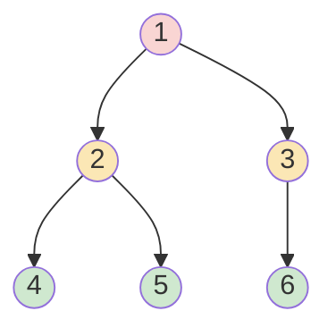

너비 우선 탐색(breadth-first search). 시작점에서 가까운 곳부터 방문. 먼저 넣은 게 먼저 나가므로 [[Queue]]로 구현 ([[Deque]]의 popleft)
- 가까운 순서로 퍼지니 도착하는 순간이 최단 거리. 목적지 경로가 여럿이어도 최단 보장 (가중치 없을 때)


방문 순서 1 → 2 → 3 → 4 → 5 → 6. 같은 색(같은 거리)끼리 먼저 다 봄

### 시작
- 언제: 최소 거리·최소 횟수 ([[B16953_AB]], [[B16236_아기_상어]]), 영역 퍼뜨리기·그룹 찾기 ([[B2667_단지번호붙이기]], [[B21609_상어_중학교]]), 연쇄로 닿는 것 모으기 ([[C_왕실의_기사_대결]]). 최단 경로를 백트래킹으로 찾으면 최단 보장도 안 되고 터짐 ([[C_포탑_부수기]])
- 아닐 때: 지나온 경로에 따라 맵이 바뀌어 경로마다 상태가 다르면(사과를 먹으면 사라짐) [[DFS]] / [[백트래킹]] ([[B26170_사과_빨리_먹기]]). 단 바뀌는 게 '벽을 부쉈는지'처럼 몇 가지 상태로 정리되면 v 차원에 넣어서 BFS 가능 ([[B2206_벽_부수고_이동하기]]). bfs로 퍼지면 경우의 수가 겹칠 때 ([[B14500_테트로미노]]). 대각선 한 방향으로 쭉 가는 건 bfs가 아님 ([[C_나무_박멸]])
- 그래프는 인접 리스트로. n+1개 만들고 0번은 안 씀. 간선 리스트·행렬로 들어와도 인접 리스트로 바꾸기. 양방향이면 양쪽 append, 낮은 번호부터면 정렬 ([[B1260_DFS와_BFS]], [[S13955_너비우선탐색_템플릿]])
- 초기화 = 단위 작업: 큐 생성, 시작점 넣기, 시작점 방문 표시. 초기화 이후에야 꺼내 쓸 수 있음. v도 탐색마다 새로 ([[B2468_안전_영역]], [[B14218_그래프_탐색_2]])
- 시작점이 여럿이면 미리 다 큐에 넣고 한 번에 돌리기. 동시에 퍼짐 ([[B7576_토마토]], [[B17142_연구소_3]])
```python
for i in range(row):
    for j in range(col):
        if arr[i][j] == 1:
            v[i][j] = 0        # 시작점이라 방문 횟수에 영향 안 주므로 0
            q.append((i, j))
```
- 시작 칸 자체가 조건에 해당할 수 있음. 들어가자마자 확인 ([[C_AI_로봇청소기]], [[B18809_Gaaaaaaaaaarden]])

### 탐색
- 꺼낸 게 기준점. 연결된 곳(인접 / 4방 / 8방)을 돌며 범위 → 미방문 → 조건이 맞으면 방문 표시 + 큐에 넣기 ([[B2178_미로_탐색]])
```python
while q:
    cur = q.pop(0) # 맨 앞에 있는게 현 위치
    x, y = cur[0], cur[1]
    for dy, dx in ((-1, 0), (1, 0), (0, -1), (0, 1)): # 상하좌우
        nx = x + dx
        ny = y + dy
        if 0 <= nx < ex+1 and 0 <= ny < ey+1:
            if v[nx][ny] == 0 and arr[nx][ny] != 0: # 방문 하지 않은 곳이고 배열 값 0이 아니면
                v[nx][ny] = v[x][y] + 1 # v 배열 값 추가
                q.append((nx, ny)) # q 값 append 해야 내 위치 갱신
```
- 큐에 넣는 것과 방문 표시는 한 세트. 조건이 다 확정된 뒤 같이. 표시만 먼저 하면 큐에 못 들어간 채 버려짐 ([[B1868_파핑파핑_지뢰찾기]], [[B7562_나이트의_이동]])
- 범위 체크를 조건 맨 앞에. 범위가 돼야 조건이든 방문 체크든 가능 ([[C_왕실의_기사_대결]], [[B17837_새로운_게임2]])
- 거리는 v에 0/1 대신 `v[cur] + 1`로 쌓기. 시작을 1로 두면 마지막에 -1. 0/1로 구분하면 방문 여부와 거리가 섞임 ([[B2178_미로_탐색]], [[B2644_촌수계산]])
- v 값으로 상태 구분 가능. 연합이면 양수, 그냥 들른 곳은 음수 ([[B16234_인구_이동]])
- 같은 칸이라도 '어떤 상태'로 왔는지가 다르면 다른 방문. 들고 다녀야 할 상태만큼 v 차원 늘리기: 벽 부쉈는지 ([[B2206_벽_부수고_이동하기]]), 말 이동 횟수 ([[B1600_말이_되고픈_원숭이]]), 방향 ([[B1726_로봇]], [[B6087_레이저_통신]]), 두 구슬 좌표 쌍 ([[C_2개의_사탕]], [[B13460_구슬_탈출_2]])
- v 공유: 영역을 나눌 땐 공유해서 중복 방지. 그룹마다 다시 세야 하는 칸은 bfs 안에서 새로 ([[B21609_상어_중학교]]). 시작점을 찾은 즉시 bfs. 모았다 돌리면 같은 영역을 중복으로 셈 ([[B1868_파핑파핑_지뢰찾기]])
- 우선순위 1: '경로'를 이동 방향 순서로 고르는 문제(우하좌상 등)면, 탐색 방향을 그 순서로 두고 처음 방문할 때만 표시하면 먼저 도착한 경로가 우선 경로 ([[C_포탑_부수기]])
- 우선순위 2: '도착할 칸'을 (행, 열)로 고르는 문제면 방향 순서만으로는 안 됨. 같은 거리의 후보를 다 모아 (거리, 행, 열)로 정렬 ([[B16236_아기_상어]])
- 거꾸로 돌리기: 목적지에서 bfs로 거리 테이블을 만들고, 그 테이블을 보며 이동 ([[C_코드트리_빵]], [[C_메이즈러너]])
- 속도: 단계마다 bfs 한 번만, 돌면서 후보 모으기 ([[B16236_아기_상어]]). 값 변경은 bfs 안에서 바로 ([[B16234_인구_이동]])
- 가중치가 있으면: 0/1뿐이면 0-1 BFS ([[Deque]]), 그 외는 [[다익스트라]]. 조건을 '미방문'이 아니라 '여기 들렀을 때 더 작아지면'으로 ([[B1261_알고스팟]], [[B14497_주난의_난]])

### 종료
- 큐가 비면 끝. 정답 처리는 방향 반복 for문을 나와서
- 목표에 도착하면 바로 return / break. 그때가 최단 ([[B14497_주난의_난]]). 최단이 정해져 있으면 그 값에서 컷 ([[B16985_Maaaaaaaaaze]])
- 끝났는데 v에 미방문이 남았으면 못 닿은 칸 → -1 ([[B7576_토마토]], [[B17142_연구소_3]])
- 시간 복잡도: 칸 수만큼 한 번. 1000 * 1000 = 10^6 가능. bfs를 여러 번 부르면 그 횟수만큼 곱하기 ([[B17142_연구소_3]], [[B23289_온풍기_안녕]])

관련: [[DFS]], [[Queue]], [[Deque]], [[다익스트라]]
