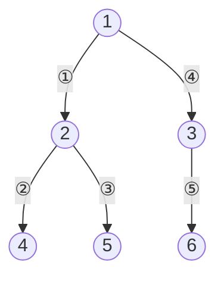

깊이 우선 탐색(depth-first search). 한쪽 분기를 정해 끝까지 간 뒤, 막다른 곳이면 되돌아와 안 간 곳으로. 되돌아올 위치를 쌓아두므로 [[Stack]] 또는 [[재귀]]로 구현
- 지나온 경로에 따라 맵이 바뀌어 경로마다 끝까지 가봐야 하면, 최소를 구해도 dfs(백트래킹) ([[B26170_사과_빨리_먹기]]). 맵이 그대로인 최단 거리는 [[BFS]]


방문 순서 1 → 2 → 4 → 5 → 3 → 6. 4에서 막히면 2로 돌아와 5로

### 시작
- 언제: 갈 수 있는지(경로 존재) ([[S4871_그래프_경로]], [[S1219_길찾기]]), 영역 개수 ([[B2583_영역_구하기]]), 정해진 길이의 경로 ([[B13023_ABCDE]]), 맵이 바뀌며 한 방향 끝까지 ([[B26170_사과_빨리_먹기]])
- 재귀는 간단하지만 파이썬은 호출 비용이 있고 기본 깊이 제한이 1000. 깊어질 수 있으면 반복문 + 스택으로
- 인접 리스트 준비는 [[BFS]]와 같음. 낮은 번호 먼저 등 시작 제약을 보고 정렬 ([[B1260_DFS와_BFS]])
- 첫 노드는 방문 안 한 상태로 스택에 넣고 시작. 그래야 첫 루프에서 갈 곳이 추가됨 ([[S4871_그래프_경로]])

### 탐색
- 반복형: while 맨 앞에서 `now = stack.pop()` 한 번만 → 목표인지 확인 → 미방문이면 방문 표시 후 인접 노드를 extend ([[S1219_길찾기]], [[S4871_그래프_경로]])
```python
to_do = [0]                  # 출발 노드 0을 장부에 넣고 시작
while to_do:
    now = to_do.pop()
    if now == 99:            # 목표 노드에 도착했으면 종료
        answer = 1
        break
    if not visited[now]:
        visited[now] = True
        to_do.extend(edge_list[now])
```
- 반복형은 extend한 이웃 중 마지막 것부터 꺼내므로 방문 순서가 재귀형과 반대. '낮은 번호 먼저' 순서가 답에 영향을 주면 이웃을 내림차순으로 넣기
- pop을 if/else 양쪽에 두면 방문한 노드일 때 now가 갱신 안 돼 옆 가지를 놓침 ([[S1219_길찾기]])
- 재귀형: 들어오자마자 방문 표시 + 첫 방문 시 할 일, 그다음 연결된 곳 반복 ([[S13781_DFS_백트래킹_템플릿]])
```python
def dfs(cur):
    v[cur] = 1               # [1] 방문표시, 첫 방문시 해야할일 처리
    ans.append(cur)
    for nxt in adj[cur]:     # [2] 연결된 노드/4/8방향 반복처리
        if v[nxt] == 0:
            dfs(nxt)
```
- 방문 처리는 for 안이 아니라 진입 직후. for 안에서 하면 방향마다 반복되고, 이동 못 할 때 현재 칸이 표시 안 됨 ([[B26170_사과_빨리_먹기]])
- 여러 경로를 다 봐야 하면 나올 때 방문 해제 → [[백트래킹]] ([[B13023_ABCDE]], [[B26170_사과_빨리_먹기]])
- 재귀형의 반환값·전역 변수 처리는 [[재귀]]
- 2차원 영역: 이중 for로 돌다 미방문 칸에서 dfs 시작. 시작 횟수 = 분리된 영역 수 ([[B2583_영역_구하기]])

### 종료
- 막다른 곳(미방문 이웃 없음)이면 후진, 스택이 비면 끝. 유한한 그래프라 언젠가 막다른 길
- 목표를 찾으면 바로 종료 ([[S1219_길찾기]], [[B13023_ABCDE]])
- 재귀형은 종료 조건을 가장 위에 ([[재귀]])

관련: [[BFS]], [[Stack]], [[백트래킹]], [[재귀]]
