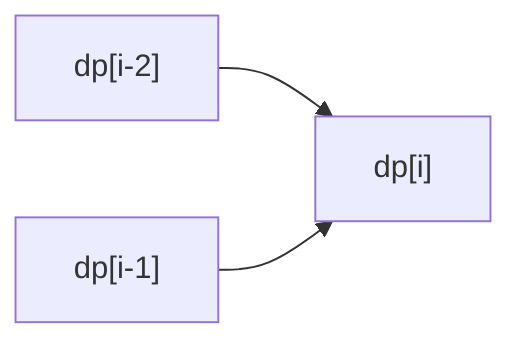

동적 계획법(Dynamic Programming). 큰 문제를 작은 문제로 나눠, 작은 문제는 한 번만 계산해 dp 테이블에 저장하고 재사용
- 조건: 최적 부분 구조. 작은 문제가 반복되고, 그 결과가 항상 같아야 함
- Bottom-up(작은 문제부터 반복문으로 채움) / Top-down(재귀 + 메모이제이션, [[재귀]])
- 그리디는 지금 최선, DP는 '이 일이 일어나려면 바로 직전에 어떻게 했어야 했는지' ([[B11048_이동하기]])


점화식으로 앞의 값에서 dp[i]를 채움

### 시작
- 판단: 직전 단계에만 의존하는지 ([[B11048_이동하기]]). 동전 단위가 서로 배수가 아니면 그리디가 틀릴 수 있음(10, 40, 50원으로 80원: 그리디는 50 + 10 × 3으로 4개, 40 + 40이면 2개). 반례가 있으면 DP. 일마다 weight가 달라도 ([[B14501_퇴사]])
- dp[i]가 무엇인지 먼저 정의 ([[B11053_가장_긴_증가하는_부분_수열]], [[B2747_피보나치_수]])
- 점화식은 마지막 동작 기준으로 경우 나누기 ([[S4869_종이붙이기]], [[B11727_2N_타일링]]). 마지막 조각이 이전에 센 조각으로 쪼개지면 중복 ([[S4869_종이붙이기]])
- 초기값과 범위 정하기. 목표 지점은 0 ([[B1463_1로_만들기]]). 최댓값이면 초기값은 아주 작게 ([[B1912_연속합]]). 0 패딩하면 위 + 왼쪽 위로 바로 계산 ([[S13786_파스칼의_삼각형]])

### 진행
- Bottom-up: 1부터 dp 테이블 채우기 ([[B1463_1로_만들기]])
```python
dp[1] = 0  # 목표치니까 연산 안 해도 된다
for i in range(2, N + 1):
    dp[i] = dp[i - 1] + 1  # 더하기 연산
    if i % 2 == 0:
        dp[i] = min(dp[i], dp[i // 2] + 1)
    if i % 3 == 0:
        dp[i] = min(dp[i], dp[i // 3] + 1)
        # 6처럼 2의 배수와 3의 배수 모두 가능하므로 elif 쓰면 안 됨
```
- 과거를 추적하지 말고 가능한 경우를 몇 갈래로 못 박기. 계단: `dp[i-2] + lst[i]` / `dp[i-3] + lst[i-1] + lst[i]` ([[B2579_계단_오르기]])
- 나부터 새로 시작 vs 이전에 이어 붙이기 중 큰 값 ([[B1912_연속합]], [[B2670_연속부분최대곱]])
- 나보다 작은 이전 값 뒤에 붙기. 앞을 다 훑어야 해서 N². 1000이면 가능. 최솟값은 1 ([[B11053_가장_긴_증가하는_부분_수열]])
- 뒤에서부터 보며 포함 / 미포함 ([[B11058_가장_긴_증가하는_부분_수열]])
- 안 풀리면 dp 차원 확장·축소, 정의를 뒤집어서 다시
- 인덱스 시작 확인. 0층부터, 1호부터 ([[B2775_부녀회장이_될테야]])

### 종료
- 답은 `dp[N]`. 'i번째를 마지막으로 포함'처럼 정의했으면 `max(dp)` ([[B11053_가장_긴_증가하는_부분_수열]], [[B1912_연속합]])
- 길이 1, 2처럼 점화식 전에 끝나는 경우 따로 처리 ([[B2579_계단_오르기]])

관련: [[재귀]], [[Greedy]], [[백트래킹]]
