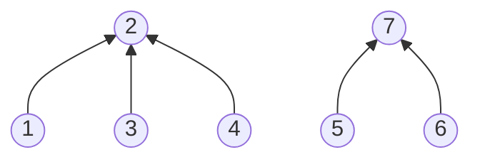

서로소 집합(공통 원소가 없는 집합)을 합치고(union), 두 노드가 같은 집합인지 확인(find)
- 집합마다 대표(루트) 하나. 같은 집합인지는 대표만 비교
- 부모를 가리키는 1차원 배열 `p`로 표현


화살표는 부모. {1, 2, 3, 4}의 대표는 2, {5, 6, 7}의 대표는 7

### 시작
- 언제: 같은 그룹인지, 갈 수 있는지 ([[B1976_여행_가자]]), 그룹 개수 ([[S14289_그룹_나누기]]), 사이클 확인 ([[최소_신장_트리]])
- 각자가 하나의 집합. `p = [x for x in range(N+1)]`로 모두 자기 자신이 대표
- 인접 리스트·행렬이 그대로 부모 테이블이 되는 게 아님. 간선 위주로 하나씩 합치기. 인덱스 +1 주의 ([[B1976_여행_가자]])

### 진행
- find: 내가 부모와 다르면 부모를 갈아치우며 올라가고, 최종 대표를 return ([[B1976_여행_가자]], [[S14290_크루스칼_최소_신장_트리]])
```python
def find(x):
    if x != p[x]: # 나 스스로랑 부모 값 다르면
        p[x] = find(p[x]) # 부모 갈아치우면서 간다
    return p[x] # 계속 부모를 리턴해야 마지막에 최종 부모가 됨
```
- union: 꼬리끼리 만나도 합치는 건 대표끼리. 내 대표의 부모를 상대 대표로 `p[find(b)] = find(a)`. find 중에 부모가 바뀔 수 있으니 대표를 먼저 뽑아두고 비교 ([[S14289_그룹_나누기]])
- 대표가 같으면 이미 같은 집합 = 합치면 사이클 ([[S14290_크루스칼_최소_신장_트리]])
- 어느 쪽이 부모가 되든 같은 그룹인지만 보면 됨 ([[B1976_여행_가자]]). 번호 규칙이 있으면 큰 대표를 작은 대표 밑으로 ([[S14289_그룹_나누기]])
- 한 줄로 길게 이어지면 find가 O(N). 대표끼리 합치고, find에서 지나간 노드의 부모를 모두 대표로 바꾸면(경로 압축) 다음부터는 한 번에 대표로 감
- union 뒤에 매번 find를 할 필요는 없음 ([[B16389_행성_연결]])

### 종료
- `p[x]`는 직속 부모, `find(x)`가 최종 대표. p에서 서로 다른 수를 세면 틀림. 마지막에 전체 find를 한 번 더 돌리고 set으로 개수 (0 제외) ([[S14289_그룹_나누기]])
- 연결 확인은 모두의 find 값이 같은지 ([[B1976_여행_가자]])
- 합친 횟수 = 노드 수 - 1이면 모두 연결 ([[B17472_다리만들기_2]])

관련: [[최소_신장_트리]], [[재귀]]
