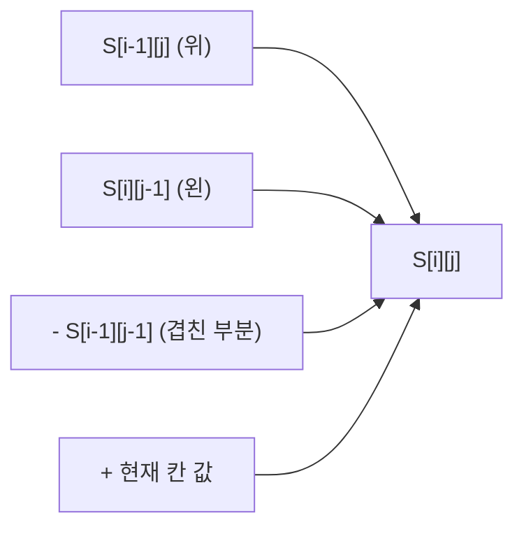

앞에서부터 더한 값을 저장해 두고, 구간 합은 빼기로 O(1)에 구함
- 1차원: `S[r] - S[l-1]`
- 2차원: 영역 합 = 전체 - 위 - 왼쪽 + 왼쪽 위 대각 (두 번 뺀 부분을 한 번 더함)



### 시작
- 언제: 같은 배열에서 구간 합을 여러 번 구할 때 ([[B1018_체스판_다시_칠하기]], [[S13679_파리_퇴치]])
- 0 패딩해서 인덱스 0의 경계 처리를 없애기 ([[B1018_체스판_다시_칠하기]])
- 무엇을 누적할지 정하기. 칸 값 대신 '패턴과 다르면 1'처럼 세고 싶은 것을 누적 ([[B1018_체스판_다시_칠하기]])

### 진행
- 누적 공식을 빠뜨리면 틀림 ([[B1018_체스판_다시_칠하기]])
```python
diff = 1 if board[i][j] != t_clr else 0
# 누적 합 공식 (이게 빠졌었어요!)
S[i][j] = S[i - 1][j] + S[i][j - 1] - S[i - 1][j - 1] + diff
```
- 상태를 누적하기: 색마다 다른 값을 더하면 누적값으로 상태 판별 (빨강 1 + 파랑 2 = 3이면 보라). 칠하는 순서·색 개수와 무관 ([[S4836_색칠하기]]). 단 같은 종류가 여러 번 더해지면 다른 조합과 누적값이 같아질 수 있음 ([[S18446_에어컨]]). 종류마다 1, 2, 4처럼 2의 거듭제곱을 주고 더하는 대신 OR(`|`)로 합치면 겹치지 않음
- 연속된 길이 세기: 이어질 땐 누적만 하고, 끊기는 순간(0이 나올 때) 체크 ([[S13680_어디에_단어가]])

### 종료
- 구간 합 꺼내기. 8*8 영역이면 `S[i][j] - S[i-8][j] - S[i][j-8] + S[i-8][j-8]` ([[B1018_체스판_다시_칠하기]])
- 누적이 끝난 뒤 한 번만 세기. 누적하면서 세면 중복 ([[S4836_색칠하기]])

관련: [[투_포인터와_슬라이딩_윈도우]], [[DP]]
