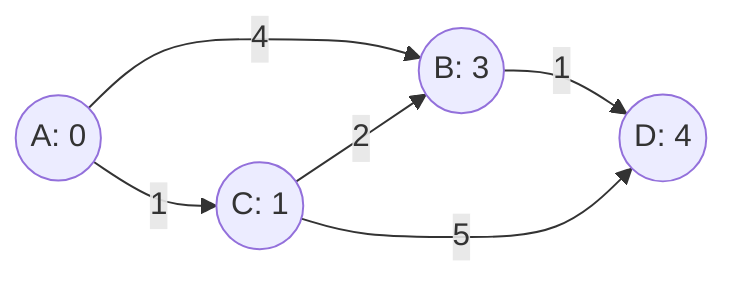

가중치가 다른 그래프에서 출발지로부터 각 노드까지의 최소 비용. 비용이 가장 작은 노드를 꺼내 확정 → 그 노드를 경유하는 비용으로 갱신
- 누적 거리라 음의 가중치가 있으면 안 됨
- 힙큐에 (비용, 노드)로 넣어 가장 작은 것부터 꺼냄
- 생김새는 [[BFS]]와 비슷. 큐 대신 힙, 조건이 '미방문' 대신 '더 작아지면'


A에서 B로 바로 가면 4, C를 경유하면 1 + 2 = 3으로 갱신. 꺼내는 순서 A → C → B → D

### 시작
- 언제: 간선마다 비용이 다른 최소 비용 ([[S14252_다익스트라_최단경로]], [[B1916_최소비용_구하기]]). 격자에서 칸마다 비용이 다를 때 ([[B1261_알고스팟]], [[S21539_미세먼지]])
- 아닐 때: 가중치가 0과 1뿐이면 [[Deque]]으로 0-1 BFS가 더 간단 ([[B14497_주난의_난]]). 모든 노드를 최소 비용으로 잇는 건 최소 신장 트리 ([[B16389_행성_연결]])
- 인접 리스트에 `(w, e)`로 weight를 앞에. 단방향인지 양방향인지 문제에서 확인 ([[S14252_다익스트라_최단경로]], [[B1916_최소비용_구하기]])
- 다익스트라 테이블: 초기값은 아주 크게(`float('inf')`), 출발지는 0. 힙에 (0, 출발지) ([[S14252_다익스트라_최단경로]]). 출발지 값도 비용에 포함이면 출발지 값으로 시작 ([[S21539_미세먼지]])
- 격자면 좌표를 그래프로 바꾸지 않아도 됨. v 배열이 곧 테이블, 힙에 (가중치, r, c) ([[B1261_알고스팟]])

### 탐색
- 꺼낸 것 중 가장 작은 게 확정. 꺼낸 값이 테이블보다 크면 이미 더 싸게 확정된 쓰레기 값이라 건너뜀. 힙에 있는 것만 보면 되고 전체 노드를 다 돌 필요 없음 ([[S14252_다익스트라_최단경로]], [[B1261_알고스팟]])
```python
heapq.heappush(hq, (0,  0)) # 초기 값 넣기
while hq:
    c_weight, cur = heapq.heappop(hq) # weight 제일 작은 것 부터 나옴
    if dj[cur] >= c_weight:
        for n_weight, nxt in adj[cur]: # 다음에 갈 수 있는 노드
            if dj[nxt] > dj[cur] + n_weight:
                heapq.heappush(hq, (dj[cur] + n_weight, nxt))
                dj[nxt] = dj[cur] + n_weight
```
- 테이블 값보다 작아질 때만 갱신하고 push. 같을 때는 불필요. 등호를 넣으면 중복이 쌓여 메모리 초과 ([[B14497_주난의_난]], [[B6087_레이저_통신]], [[B17396_백도어]])
- 같은 비용의 경우의 수를 세야 하면 최소 비용과 개수를 따로 저장하고, 같은 비용이면 개수만 더함. 방문 시점은 힙에서 꺼낼 때 ([[B12851_숨바꼭질2]])
- 넣을 땐 `heappush`. `hq.append`로 넣으면 일반 리스트가 됨 ([[B1261_알고스팟]])
- 방향 같은 상태가 비용에 영향을 주면 (r, c, 방향)별 테이블 → 3차원 다익스트라 ([[B6087_레이저_통신]])
- 범위 밖(음수, 너무 큰 값)으로 가면 최선이 될 수 없으니 컷 ([[B13549_숨바꼭질_3]])
- 조건 분기가 복잡하면 전처리로 단순하게. 갈 수 없게 표시된 도착지를 갈 수 있게 바꾸기 ([[B17396_백도어]])

### 종료
- 힙이 비면 테이블 완성. `테이블[도착]`이 답
- 도착지 하나만 필요하면 꺼낸 노드가 도착일 때 break. 꺼낸 건 확정이므로 ([[B1916_최소비용_구하기]])
- 끝까지 초기값이면 도달 불가

관련: [[BFS]], [[Deque]]
