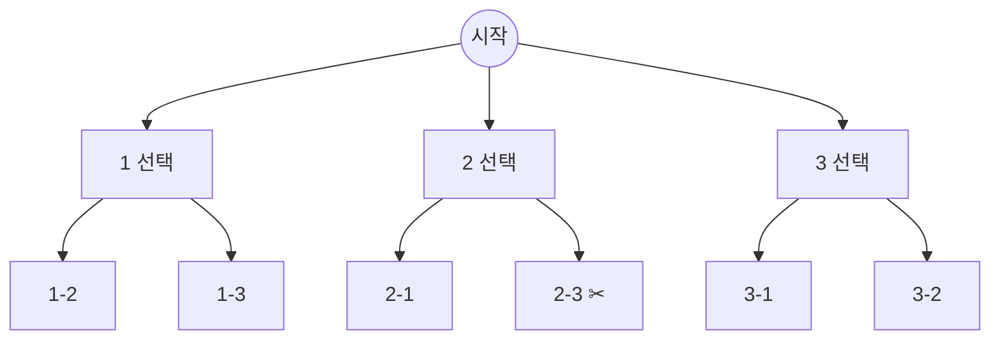

모든 경우를 트리로 표현해 하나씩 골라 들어갔다가, 돌아올 때 선택을 되돌리고 다음 선택으로. [[재귀]]로 구현
- 모든 경우를 처리하니 반드시 정답. 틀렸다면 정답이 안 나옴. 시간초과만 조심
- 더 가도 의미 없는 가지는 미리 자름(가지치기)


깊이 = 고른 개수. 끝까지 가면 정답 처리, 돌아오며 선택 해제. ✂는 가지치기로 안 들어간 가지

### 시작
- 언제: N이 작고 모든 경우를 봐야 할 때. k ≤ 3, 4⁸, 4¹⁰ ≈ 10⁶ ([[B28215_대피소]], [[B15683_감시]], [[B13460_구슬_탈출_2]]). 순간 최선만 고르면 최선이 여럿일 때 놓침 ([[B15683_감시]])
- 아닐 때: 2^(15*15)처럼 커지면 무조건 안 됨. 최단 경로는 [[BFS]] ([[C_포탑_부수기]]). 강의 기준은 시간 10⁸, 공간 10⁶. 파이썬은 단순 연산도 1초에 수천만 번 수준이라 이보다 여유 있게 잡기
- 먼저 트리로 표현: 깊이 n이 무엇인지(던진 횟수, 행 번호, 고른 개수), 한 층에서 무엇을 고르는지. 종료 조건은 n과 관련된 것에서 찾기 ([[B13992_전자카트]])
- 순열 / 조합 / 부분집합 구분
  - 순열: 순서가 중요. v로 중복 체크 후 해제 ([[B15649_N과_M(1)]], [[S13849_배열_최소_합]])
  - 조합: 순서 무관, v 필요 없음. 다음 시작값 = 내가 고른 값 + 1 ([[B15650_N과_M(2)]], [[B14889_스타트와_링크]])
  - 부분집합: 0~N개의 모든 조합. 포함 / 미포함 2갈래, 비트로도 가능 ([[B1182_부분수열의_합]], [[S13675_부분집합의_합]])
- 정답 초기값: 최솟값이면 무조건 갱신되는 최악의 값으로 ([[S13849_배열_최소_합]], [[S14013_최소_생산_비용]])

### 탐색
- 고르고 → 들어가고 → 되돌리기. append하고 pop하듯 다음 호출 땐 다시 깨끗하게 ([[S13849_배열_최소_합]])
```python
for col in range(N): # 열 갯수 돌면서
    if v[col] == 0:
        v[col] = 1
        btk(n+1, sm + arr[n][col]) # j가 몇 번째 열인지
        v[col] = 0 # append 하고 pop 하듯이 다음 함수 부를 때는 다시 깨끗하게
```
- 행은 깊이로 고정하고 열만 for. 안에서 for를 또 돌리지 말고 idx로 넘기기. d와 idx 모두 종료 조건 ([[S2112_보호_필름]], [[B9663_NQUEEN]])
- 한 호출에 선택 하나만. 경기 리스트를 미리 만들고 d를 인덱스로, 승 / 무 / 패 3번 호출 ([[B6987_월드컵]]). 놓는다 / 안 놓는다 2갈래 ([[B33927_나이트_오브_나이츠]])
- 방문 체크는 인덱스로 바로 보는 v 배열(`v[j]`)이 가장 빠름. N이 작으면 `not in` 리스트·set보다 1.5배쯤 빠름 (배열 최소합: v 배열 6000ms, 리스트·set 8000ms). `v + [j]`로 매번 새 리스트를 넘기는 방식은 리스트 `in`과 비슷하거나 더 느림 (강의 측정에선 시간초과)
- 원소가 많아지면 리스트 `in`은 O(N)이라 급격히 느려짐. 배열을 못 쓰는 상황(좌표, 큰 수)이면 set ([[B23290_마법사_상어와_복제]])
- 상태 넘기기: 전역이면 원복 필수. 8*8, 10*10처럼 작으면 복사해서 인자로 넘기는 게 안전 ([[B15683_감시]], [[B16235_나무_재테크]]). `arr[:]`는 2차원 내부까지 복사 못 함 → `[line[:] for line in arr]` ([[B14502_연구소]])
- 모든 경우에 공통인 작업은 먼저 하고, 그 결과를 복사한 뒤 분기 ([[B19236_청소년_상어]])
- 전역 결과 리스트에 경로를 담을 땐 복사본 `path[:]`. 그대로 넣으면 나중에 pop되어 다 빈 리스트가 됨
- 같은 행에서도 여러 개 고를 수 있으면 행마다 하나씩 고르면 안 됨 ([[B14502_연구소]])
- 갔다가 돌아와야 하는 모양(ㅗ)은 연속 백트래킹으로 못 찾음. 따로 처리 ([[B14500_테트로미노]])
- 후보는 미리 추리기. 놓을 수 있는 좌표만 뽑아 넘기고 안에선 고르냐 마냐만 ([[B15684_사다리_조작]], [[S1767_프로세서_연결하기]])

### 종료
- 종료 조건에서 정답 처리 후 무조건 return
- 가지치기는 제일 위에서. 더 진행해도 정답 갱신이 안 되면 return. 최솟값 문제는 지금 합이 ans 이상이면 컷 (더할 값이 음수가 아닐 때만 성립) ([[S14013_최소_생산_비용]], [[S13802_길찾기]])
- 남은 걸 다 더해도 최대를 못 넘으면 컷 ([[S1767_프로세서_연결하기]])
```python
if chip + (chip_num - d) < mx_chip:
    return
```
- 남은 횟수로 고칠 수 있는 것보다 어긋난 게 많으면 컷 ([[B15684_사다리_조작]]). 조건상 불가능하면 컷 ([[B6987_월드컵]]). 이 줄에 못 놓으면 다음 줄 볼 필요 없음 ([[B9663_NQUEEN]]). 같은 방향 연속 2번이면 컷 ([[B13460_구슬_탈출_2]])
- 답이 하나면 찾자마자 전체 종료 ([[B3967_매직_스타]], [[B15684_사다리_조작]])
- return은 그 호출의 남은 경우까지 전부 종료, continue는 그 경우만. 정답일 때만 return ([[B13460_구슬_탈출_2]])
- 가지치기 없이 먼저 로직을 맞추고 그다음 가지치기 ([[B17281_야구]], [[B14500_테트로미노]])

관련: [[재귀]], [[DFS]], [[BFS]]
