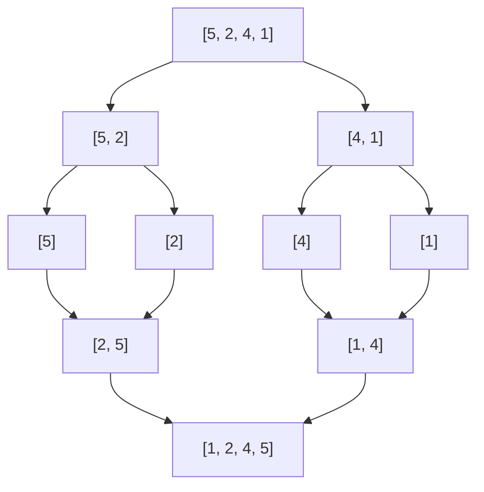

더 나눌 수 없을 때까지 쪼개고(분할), 작은 답을 합치며(정복) 큰 답을 만듦. [[재귀]]로 구현
- 퀵 정렬: 기준값(pivot)보다 작은 값은 왼쪽, 큰 값은 오른쪽으로 나누는 작업을 반복. 평균 N log N, 최악 N²
- 병합 정렬: 중간에서 계속 쪼개기만 하고, 합칠 때 정렬. 항상 N log N


병합 정렬. 내려가며 쪼개고, 올라오며 합칠 때 정렬

### 시작
- 무엇을 넘길지: 1차원은 start·end 인덱스, 2차원은 시작 좌표 + 길이 ([[B2630_색종이_만들기]]). 인덱스로 넘기면 앞·뒤 모두 포함 ([[S13845_토너먼트_카드_게임]])
- 종료 조건: 길이가 1 이하, 또는 s == e ([[B2750_병합_정렬_수_정렬하기]], [[S13845_토너먼트_카드_게임]])

### 진행
- 먼저 전수 조사, 조건이 안 맞을 때만 쪼개기. 반대로 생각하면 꼬임 ([[B2630_색종이_만들기]])
```python
if cnt != 0 and cnt != l**2:
    nl = l//2
    cut(sr, sc, nl)
    cut(sr, sc + nl, nl) # 다음으로 넘어가니까 l은 다 //2
    cut(sr + nl, sc, nl)
    cut(sr + nl, sc + nl, nl)
```
- 다 쪼갤 필요 없이 필요한 쪽만: 정답이 속한 사분면 하나만 보고 반씩 쪼개기. 앞 사분면들의 칸 수(4^(N-d))만큼 더하고, 사분면 시작점을 더해 절대 좌표처럼 ([[B1074_Z]])
- 퀵 정렬: 첫 값을 pivot으로. pivot 위치는 고정하고, 같은 값이나 빈 왼쪽도 있을 수 있음 ([[B2750_퀵_정렬_수_정렬하기]], [[S5205_퀵_정렬]])
- 병합: 두 리스트 앞부터 비교해 작은 쪽을 넣고 그쪽 화살표만 전진. 남은 건 한꺼번에 이어 붙이기 ([[B2750_병합_정렬_수_정렬하기]], [[B11650_좌표_정렬하기]])

### 종료
- 돌아오면서 합치기. 정렬은 정렬된 결과를 받아 합침 (`return quick(left) + [pivot] + quick(right)`) ([[B2750_퀵_정렬_수_정렬하기]], [[B2750_병합_정렬_수_정렬하기]])
- 리스트를 더해 반환하면 복사본이라 안전하지만 메모리를 많이 씀 ([[B2750_퀵_정렬_수_정렬하기]])
- 돌아올 땐 필요한 것 하나만 들고 오기. 이긴 카드 인덱스만 ([[S13845_토너먼트_카드_게임]])
- 개수만 세면 되면 돌아오는 값 없이 전역 변수에 쌓기 ([[B2630_색종이_만들기]])

관련: [[재귀]], [[정렬]]
