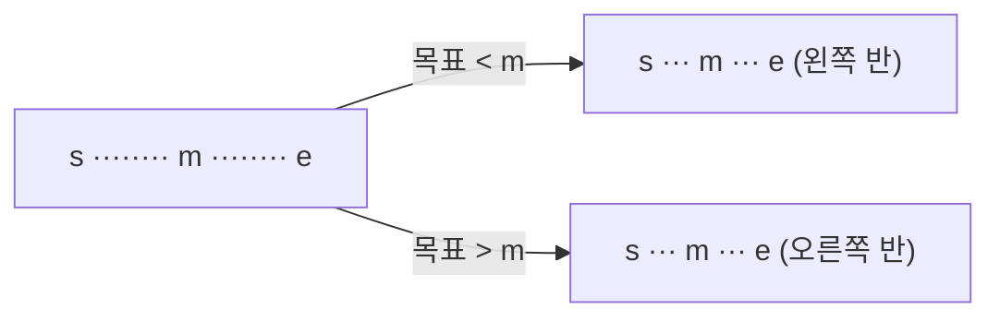

오름차순 정렬된 데이터에서 맨 중간을 보고 반을 버리고, 남은 반에서 또 반을 버리며 찾기. O(log N)
- 10³ ≈ 2¹⁰이라 10⁹도 약 30번이면 찾음



### 시작
- 언제: 숫자가 크고 하나하나 찾아서는 될 리가 없을 때 ([[B2512_예산]], [[B2805_나무_자르기]], [[B1920_수_찾기]])
- 배열에서 값을 찾을 땐 오름차순 정렬이 먼저. 찾는 쪽만 정렬하고 찾을 목록은 그대로 ([[B1920_수_찾기]], [[B10815_숫자_카드]])
- 무엇을 반씩 줄일지 정하기. 인덱스가 아니라 답 자체일 수 있음: 자르는 높이 H ([[B2805_나무_자르기]]), 예산 상한선 ([[B2512_예산]]), 제곱근 값 ([[B13706_제곱근]])
- 답 자체를 찾을 땐 정렬 대신 조건이 한쪽으로만 바뀌어야 함(어느 값부터 쭉 만족, 그 전은 쭉 불만족). 들쭉날쭉한 조건(안전 영역처럼 높이에 따라 늘었다 줄었다)은 이진 탐색 불가
- 문제에 중간값 공식이 주어지면 그대로 ([[S4839_이진탐색]])

### 진행
- `while s <= e`. s와 e가 같아졌다고 바로 끝내지 말고 한 번 더 보기. mid 계산은 while 안에서 ([[B2512_예산]])
```python
while s <= e:
    mid = (s + e) // 2  # mid가 threshold
    ...
    if sm <= goal:
        # 정답 조건
        ans = mid
        s = mid + 1
    else:
        e = mid - 1
```
- 본인(mid)은 포함해서 버리기. 작으면 왼쪽, 크면 오른쪽으로 기준을 통일. 좌우를 바꾸면 헷갈림
- 최댓값을 찾을 땐 조건을 만족하면 ans에 일단 저장하고 오른쪽으로. 딱 맞는 값이 마지막 만족일 수 있음 ([[B2805_나무_자르기]], [[B2512_예산]])
- 시간은 대부분 조건 확인에서 걸림. 조건 계산을 가볍게
- 경계가 답일 수 있음. 가장 앞과 0 사이가 답이면 0을 패딩 ([[B2805_나무_자르기]])
- `start + (end - start) // 2`는 다른 언어의 오버플로우 예방용. 결과는 `(s + e) // 2`와 같고, 파이썬은 정수 오버플로우가 없어 차이 없음 ([[S4839_이진탐색]])

### 종료
- s > e가 되면 끝. ans가 답
- 위치를 찾는 문제면 찾는 즉시 return
- 탐색 횟수를 셀 땐 한 번에 찾은 경우도 1회 ([[S4839_이진탐색]])
- 탐색 전에 답이 정해지는 경우: 총합이 예산 이하면 다 주고 끝 ([[B2512_예산]])

관련: [[정렬]], [[트리_순회]]
