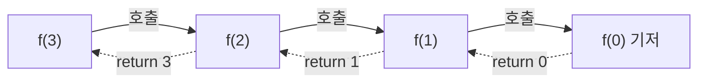

함수가 자기 자신을 부름. 큰 문제를 같은 모양의 작은 문제로 나눠 풂. 구조는 종료 조건(기저) + 단위 작업 + 재귀 호출
- 짧은 게 장점. 대신 명료해야 해서 보면 쉬운데 직접 짜기는 어려움
- 내부 스택에 쌓였다가 기저를 찍고 하나씩 돌아옴 ([[Stack]])


`f(n) = f(n-1) + n` 기준. 내려갈 땐 호출만, 돌아오면서 더함

### 시작
- 종료 조건(기저 조건)을 가장 위에, 매우 명확하게. 종료 조건 파라미터를 가장 먼저 ([[B18217_주사위던지기2]])
- 무엇을 넘길지 정하기: 위치(2차원은 시작 좌표, 1차원은 start·end), 크기(변 길이), 들고 다닐 값(누적) ([[B2630_색종이_만들기]], [[B13992_전자카트]])
- 종료 조건과 정답 조건은 다름. 합은 종료 조건이 아니라 정답 조건 ([[B18219_주사위던지기3]]). 몇 개 뽑았는지가 아니라 전체를 다 본 뒤 끝 ([[B1182_부분수열의_합]])
- 메인에서는 최상단 하나만 부르면 됨
- 깊이가 깊으면 `sys.setrecursionlimit`. BFS에는 필요 없음 ([[B2667_단지번호붙이기]])

### 호출
- 재귀 호출은 라이브러리 함수라고 생각하고 사용. 무슨 일을 하는지 먼저 정의하고, 짜면서 따라가지 말고 특정 시점 기준으로 구현
- 단위 작업은 최소한. 내 단위 작업이 n이면 나머지는 재귀에 맡기기 ([[S18212_1부터_N더하기]])
```python
def acc2(n):
    # 종료 조건
    if n == 0:
        return 0
    else:
        return acc2(n-1) + n
    # 호출하면서 더하기
```
- 호출 앞/뒤 위치에 따라 순서가 바뀜. 호출 뒤(리턴할 때) 출력하면 역순 ([[S18211_N부터_1출력]]). append 위치에 따라 값이 변한 뒤 들어감 ([[S18210_1부터_N출력]])
```python
def prt_N_1(n):
    # 종료 조건
    if n > N+1:
        return
    # 재귀 조건
    prt_N_1(n+1)
    # 단위 작업
    print(n)
```
- 인자로 `sm + i`를 넘기면 자식 쪽 값만 바뀜. `sm += i`처럼 내 변수를 직접 바꾸면 for문의 다음 형제 호출까지 그 값이 누적되어 답이 틀어짐 ([[S13675_부분집합의_합]]). 리스트는 참조라 append로 넘기면 계속 변함. `lst + [i]`로 새로 만들어 넘기기 ([[S18216_주사위던지기1]])
- global: 리스트·arr를 append나 `arr[i] = x`로 고치는 건 global 없이 됨. 숫자 변수처럼 `=`로 새로 대입하면 global 필요 (리스트도 `lst = [...]`로 통째로 바꾸면 필요). global에 쌓으면 재귀적인 흐름은 아님 ([[S18212_1부터_N더하기]], [[S18211_N부터_1출력]])
- 함수 안에서 리스트를 만들면 호출마다 초기화됨 ([[B11725_트리의_부모_찾기]])
- 필요한 쪽만 부르기 ([[분할_정복]])
- 호출 횟수는 (분기 수)^(깊이)로 늘어남. 분기 12, 깊이 4면 12 + 12² + 12³ + 12⁴ ([[S5656_벽돌_깨기]])

### 종료
- 기저에서 return → 돌아오면서 남은 일 처리. 돌아오면서 합치는 방식은 [[분할_정복]]
- 결과는 따로 저장하지 말고 return으로 ([[S18213_팩토리얼]])
- 반환값은 부모가 받아야 함. `result = dfs(nxt)`로 받지 않으면 사라짐. 답 하나만 찾는 거면 return으로 넘기기보다 전역 변수에 쌓는 게 덜 꼬임 ([[S13802_길찾기]], [[B2630_색종이_만들기]])
- 답을 찾으면 바로 빠져나오기. True를 반환하고 재귀 호출을 if문 안에 ([[B3967_매직_스타]], [[B3967_매직_스타]])
- 이미 구한 값은 바로 return (메모이제이션) ([[S14021_노드의_합]])

관련: [[DFS]], [[백트래킹]], [[Stack]]
