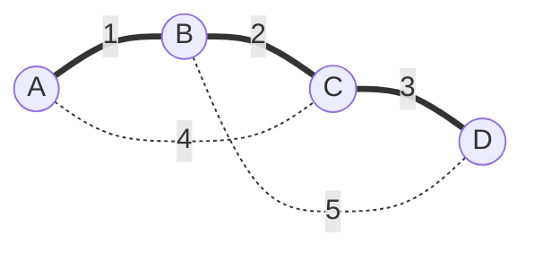

신장 트리: 그래프의 모든 정점을 포함하고 사이클이 없는 트리. 간선은 V-1개. 그중 가중치 합이 최소인 것이 최소 신장 트리(MST)
- 크루스칼: 간선 중심. 가중치가 작은 간선부터, 사이클이 안 생기면 선택
- 프림: 노드 중심. 연결된 노드들에서 나가는 가장 싼 간선으로 새 노드 추가
- 음수 가중치도 가능 (누적 거리가 아니므로)


굵은 선이 선택된 간선 (1 + 2 + 3 = 6). A-C(4), B-D(5)는 이미 연결된 두 점을 잇는 간선이라 사이클이 생겨서 제외

### 시작
- 언제: 모든 노드를 최소 비용으로 연결 ([[B16389_행성_연결]], [[B17472_다리만들기_2]]). 출발지 하나에서의 최소 비용은 [[다익스트라]]
- 크루스칼: 간선을 (w, s, e)로 모아 정렬. 방문 체크 필요 없고 인접 리스트는 오히려 불편 ([[S14290_크루스칼_최소_신장_트리]])
- 프림: 양방향 인접 리스트에 (w, e). 힙에 (0, 시작 노드) ([[B11197_프림_최소_스패닝_트리]])
- 간선 줄이기: 비용 행렬이면 윗 대각선만 받아 중복 제거 ([[B16389_행성_연결]]). 격자면 섬을 bfs로 그룹 짓고, 한 방향 직선으로 길이 2 이상인 다리만 간선 ([[B17472_다리만들기_2]])

### 진행
- 크루스칼: 가장 싼 간선부터. 두 끝의 대표가 같으면 사이클이라 건너뛰고, 다르면 합치고 비용 더함 ([[S14290_크루스칼_최소_신장_트리]], [[Union_Find]])
```python
edge.sort()
for info in edge:
    w, s, e = info[0], info[1], info[2]
    cycle = union(s, e)
    if cycle:
        continue
    else:
        ans += w
```
- 프림: 현재 정점에서만 보지 말고 방문된 모든 정점에서 가장 작은 간선 → 힙. 꺼낸 노드가 이미 방문이면 거르고, 비용도 거른 뒤에 더함 ([[B11197_프림_최소_스패닝_트리]])
- 간선이 미리 다 주어지면 힙에 하나씩 넣고 빼는 대신 한 번 sort로 충분. 행성 연결에선 sort로 바꾸고 윗 대각선만 받는 것까지 합쳐 4092 → 1528ms ([[B16389_행성_연결]])

### 종료
- 간선을 V-1개 고르면 끝. 합친 횟수가 노드 수 - 1보다 적으면 연결 불가 ([[B17472_다리만들기_2]])
- 프림은 힙이 비면 끝

관련: [[Union_Find]], [[다익스트라]], [[Greedy]]
