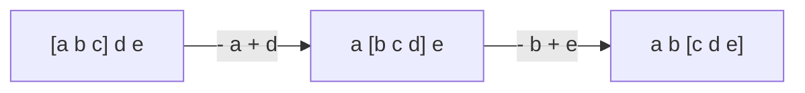

구간을 매번 새로 계산하지 않고, 경계만 움직이며 바뀐 만큼만 반영. O(N)
- 투 포인터: 두 인덱스를 동시에 움직이며 구간을 늘리고 줄임. 구간 크기가 바뀜
- 슬라이딩 윈도우: 크기가 고정된 구간을 한 칸씩 밀며 빠지는 값은 빼고 들어오는 값은 더함



### 시작
- 언제: 범위가 커서 구간 합을 매번 새로 구하면 시간 초과 ([[B2018_수들의_합]]). 인덱스 for 4개로 매번 다 더하고 있을 때 ([[S13679_파리_퇴치]]). 앞뒤를 맞춰 비교할 때 ([[S4861_회문]])
- 윈도우 개수는 N - M + 1 ([[S4835_구간합]], [[S4861_회문]]). 8*8 체스판이면 (m-7) * (n-7)개 ([[B1018_체스판_다시_칠하기]])
- 원래 순서 그대로. 재배열하지 않기 ([[S4835_구간합]])

### 진행
- 투 포인터: 합이 부족하면 end를 늘려 더하고, 넘치면 start를 빼고 늘림. 포인터 변수가 곧 더할 숫자. while 하나로 됨 ([[B2018_수들의_합]])
```python
while i <= goal:
    if sm < goal:
        j += 1
        sm += j # 더하는 건 1 더하고 가고
    if sm > goal:  # 자기 자신의 경우도 여기에 걸림
        sm -= i # 빼는 건 먼저 1 빼고 가고 (시작 포인터와 끝 포인터가 같은 위치이므로)
        i += 1
    if sm == goal:
        ans += 1
        # 답 나왔을 때 답 갯수만 더하면 무한 루프
        j += 1
        sm += j
```
- 답이 나왔을 때 개수만 세면 무한 루프. 포인터를 움직여 답을 벗어나게 ([[B2018_수들의_합]])
- 회문: 앞뒤 포인터를 좁혀가며 m//2까지 비교. 구간을 잘라 `[::-1]`과 비교해도 됨 ([[S4861_회문]])
- 포인터를 마음대로 건너뛰거나 되돌리려면 for 대신 while ([[S4861_회문]])
- 슬라이딩 윈도우: 첫 윈도우 합만 구하고, 이후는 `이전 합 - 빠지는 값 + 들어오는 값`. 2차원은 가로로 한 번 밀어 행 합을 만들고, 그 합을 다시 세로로 밀기 ([[S13679_파리_퇴치]])
- 2차원 이중 슬라이싱 `arr[i:i+8][j:j+8]`은 안 됨 ([[B1018_체스판_다시_칠하기]])

### 종료
- 포인터가 끝을 넘으면 종료. 자기 자신 하나짜리 구간도 세는지 반례로 확인 ([[B2018_수들의_합]])

관련: [[누적합]]
