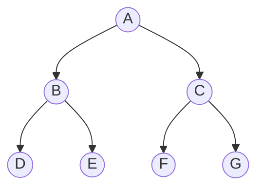

트리: 노드와 간선으로 이루어진, 사이클 없는 계층 구조
- 루트(맨 위), 리프(자식 없음), 부모·자식·형제. 레벨(루트에서 떨어진 정도), 차수(자식 수), 깊이(가장 먼 리프까지)
- 이진 트리: 자식이 최대 2개(왼, 오). 완전 이진 트리: 마지막 레벨 빼고 다 차 있고, 마지막 레벨은 왼쪽부터 채워짐
- 순회: 레벨 순([[BFS]]) / 깊이 우선([[DFS]])의 전위·중위·후위


- 전위(부 → 왼 → 오): A B D E C F G
- 중위(왼 → 부 → 오): D B E A F C G
- 후위(왼 → 오 → 부): D E B F G C A

### 시작
- 완전 이진 트리는 1차원 배열로. 인덱스 1부터, i의 자식은 `2*i`, `2*i+1`, 부모는 `i // 2` ([[S14020_중위순회]], [[S14021_노드의_합]])
- 완전 이진 트리가 아니면 왼쪽·오른쪽 리스트 2개나 dict(부모: (왼, 오)) ([[B1991_트리_순회]]). 없는 자식은 0으로 패딩하면 조건에서 자동 False. 부모 리스트를 따로 두면 스스로가 부모인 노드가 루트
- 일반 트리는 인접 리스트. 구하려는 걸 가장 간단히: 자식 idx에 부모 저장 ([[B11725_트리의_부모_찾기]])

### 탐색
- 존재하는 노드면(`1 <= n <= N`) 왼·오는 재귀로, 내 단위 작업은 순회 종류에 맞는 자리에 ([[S14020_중위순회]])
```python
def in_ord(n):
    if n < 1 or n > num: #노드 갯수 넘어가면
        return
    else:
        in_ord(n * 2) # 자식 왼쪽 보고 - 하나만 보는게 아니라 끝까지 갈 때 까지 계속 저기에 걸림
        ans.append(lst[n]) # 더 이상 갈 수가 없으면 나를 저장, 그리고 다시 올라옴(return)
        in_ord(n * 2 + 1) # 자식 오른쪽 봄
```
- 전위는 나부터 저장, 중위는 왼쪽 다녀온 뒤, 후위는 자식 다 다녀온 뒤 저장 ([[S14020_중위순회]])
- 이진 탐색 트리를 중위 순회하면 작은 순서 ([[S14081_이진탐색]])
- 자식 값을 모아 부모를 계산하면 후위 순회 ([[S14021_노드의_합]], [[S14025_사칙연산]]). 형제끼리 더하는 방식은 완전 이진 트리일 때만 가능 ([[S14021_노드의_합]])
- 방문하는 n은 값이 아니라 idx. 넣을 값은 카운터를 따로 ([[S14081_이진탐색]])
- 안 되는 조건을 먼저 return해서 분기 줄이기 ([[B1991_트리_순회]])

### 종료
- 자식이 없으면(범위 밖, 0, '.') 자동으로 돌아옴
- 순회 결과는 `"".join(ans)`로 출력

관련: [[DFS]], [[BFS]], [[재귀]]
