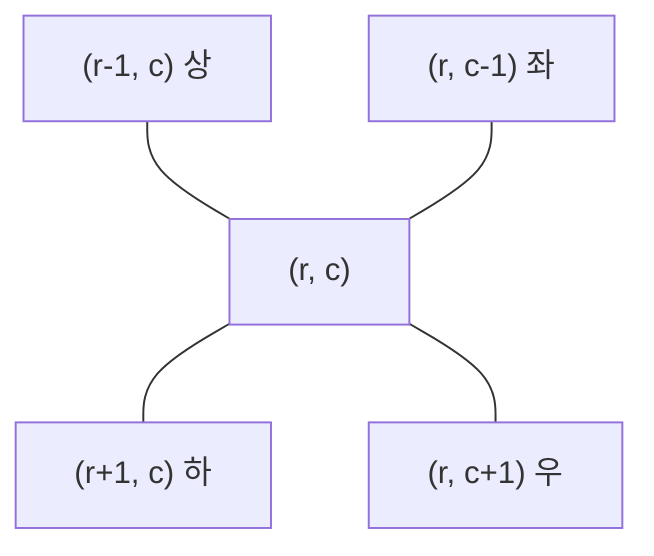

2차원 격자에서 칸을 (행 r, 열 c)로 다루고, 이웃 칸은 델타(dr, dc)를 더해 구하기



### 원리
- 델타 탐색: 방향마다 (dr, dc)를 리스트로 두고 for로 돌기. 4방 `((-1, 0), (1, 0), (0, -1), (0, 1))`, 8방은 대각 4개 추가
- 범위 체크는 조건 하나로 `0 <= nr < N and 0 <= nc < M`. 밖이면 계산하지 않기 ([[S13666_델타검색]])
- 범위 밖 좌표를 0이나 N-1로 고정하면 끝 칸이 자기 자신·엉뚱한 칸과 계산됨. 조건을 네 개로 나눠 쓰면 하나만 틀려도 디버깅이 어려움 ([[S13666_델타검색]])
```python
if nxt_i<0:
    nxt_i = 0
elif nxt_i>=n:
    nxt_i = n-1
```
- 범위 체크를 조건 맨 앞에. 범위가 맞아야 그 칸의 값·방문을 볼 수 있음 ([[C_왕실의_기사_대결]], [[B17837_새로운_게임2]])

### 활용
- 끝이 이어진 격자(도넛)는 `% N`으로 반대편으로 넘어가기 ([[B27211_도넛_행성]], [[B21610_마법사_상어와_비바라기]], [[B20056_마법사_상어와_파이어볼]])
- 대각선은 r + c(↗ 방향) 또는 r - c(↘ 방향)가 일정 ([[B9663_NQUEEN]], [[B17779_개리맨더링2]])
- 꺼낸 현재 위치에서 다음 위치를 계산. 시작 좌표를 그대로 들고 가지 않기 ([[B2178_미로_탐색]])
- 사람·물고기처럼 위치가 있는 객체는 좌표 리스트로, 격자는 표시만 ([[B21610_마법사_상어와_비바라기]], [[자료구조_선택_기준]])

### 주의
- 문제가 x, y로 주면 x는 열(c), y는 행(r). 받는 순간 r, c로 바꾸기 ([[B16235_나무_재테크]], [[B9205_맥주_마시면서_걸어가기]], [[B8983_사냥꾼]])
- 그림의 위아래가 뒤집혀 있으면(아래가 1행) 행 번호도 뒤집기. 출력할 때 다시 원래대로 ([[B1063_킹]], [[B13567_로봇]], [[C_미생물_연구]])
- 1 인덱스 입력: 받을 때 -1 하거나 0번을 비운 배열로. 문제의 공식이 1 인덱스 기준이면 그대로 옮길 때 주의 ([[B21611_마법사_상어와_블리자드]], [[B23747_와드]], [[B19237_어른_상어]])
- 범위 끝은 포함 여부 확인. 끝 좌표가 포함이면 `< end + 1` ([[B2178_미로_탐색]])
- 가로·세로 변수 이름을 반대로 적으면 끝까지 그대로 짜게 됨. 처음에 r, c로 통일 ([[C_왕실의_기사_대결]])

관련: [[방향_관리]], [[상대_좌표와_패딩]], [[BFS]]
