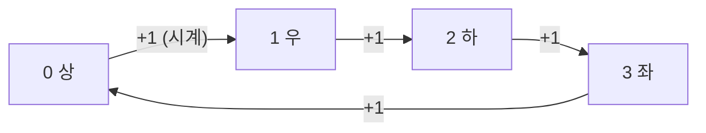

방향을 번호로 두고 델타·회전·반대 방향을 계산하기


시계 방향 순서(상우하좌)로 번호를 매기면 회전은 `(d + 1) % 4`, 반시계는 `(d - 1) % 4`, 반대는 `(d + 2) % 4`

### 원리
- 방향 번호와 델타를 짝으로: `dr = [-1, 0, 1, 0]`, `dc = [0, 1, 0, -1]`. 문제가 준 번호 순서(1부터, 상하좌우 등)를 그대로 따라 리스트를 만들기
- 번호를 시계 순서로 두면 회전과 반대 방향이 산술로 나옴. 순서가 상하좌우처럼 섞여 있으면 반대 방향 테이블을 따로 ([[B17837_새로운_게임2]])
```python
opposite = [2, 1, 4, 3]
...
mal_dirr[idx] = opposite[mal_dirr[idx] - 1] # 여기서 바로 방향 전환
```
- 명령 문자로 오면 dict로 바로 델타 ([[S1873_상호의_배틀필드]], [[B1063_킹]], [[Dictionary]])
- 회전이 잦으면 방향 순서를 [[Deque]]에 넣고 rotate ([[B14503_로봇_청소기]], [[B1913_달팽이]])

### 활용
- 튕기면 방향 자체를 바꿔 저장. 좌표만 반대로 계산하면 그 단계는 맞아도 다음 단계부터 어긋남 ([[B23288_주사위_굴리기2]], [[B17837_새로운_게임2]])
- 방향 변화량을 원래 방향 변수에 누적하지 말고 새 변수(`nd`)로. 누적되면 0, 1, 3, 6처럼 튐 ([[C_싸움땅]])
- 방향마다 '이동 순서'가 다르면 각각 테이블로. 첫 이동은 상하좌우, 둘째는 좌우상하 ([[C_메두사와_전사들]])
- 다음 방향을 미리 저장해두면 다음 좌표도 바로 나옴 ([[C_술래잡기]])
- 직전 방향의 반대로 바로 돌아가는 경우를 막거나 허용할지 문제 조건 확인 ([[B23290_마법사_상어와_복제]], [[B13460_구슬_탈출_2]])
- 구조물·블록과 방향의 연결은 [[룩업_테이블]]로 ([[S1953_탈주범_검거]], [[S5650_핀볼_게임]])

### 주의
- 1 인덱스 방향 번호를 0 인덱스 리스트에 쓸 땐 -1 ([[B17837_새로운_게임2]], [[B19237_어른_상어]])
- 방향 변수를 함수 밖에 빼서 여러 곳에서 쓰면, 바뀌어야 할 곳에서 안 바뀜 ([[B17837_새로운_게임2]])
- 디버깅할 땐 위치뿐 아니라 바라보는 방향도 찍기 ([[C_술래잡기]], [[C_꼬리잡기놀이]])
- 8방에서 대각과 상하좌우의 거리 공식이 다를 수 있음 ([[C_루돌프의_반란]])

관련: [[격자_좌표_처리]], [[Deque]], [[룩업_테이블]]
