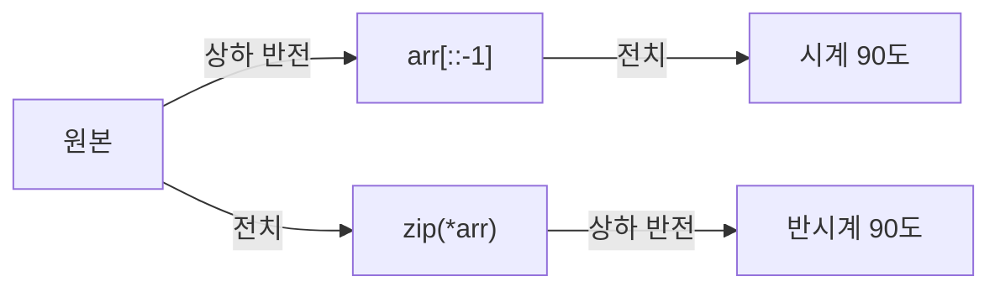

2차원 배열을 돌리거나 뒤집기. 전치(행과 열 바꾸기) + 뒤집기 조합으로 모든 90도 회전을 만듦

| 하고 싶은 것 | 코드 | `[[1,2,3],[4,5,6]]` 결과 |
|---|---|---|
| 전치 | `[list(r) for r in zip(*arr)]` | `[[1,4],[2,5],[3,6]]` |
| 시계 90도 | `[list(r) for r in zip(*arr[::-1])]` | `[[4,1],[5,2],[6,3]]` |
| 반시계 90도 | `[list(r) for r in zip(*arr)][::-1]` | `[[3,6],[2,5],[1,4]]` |
| 상하 반전 | `arr[::-1]` | `[[4,5,6],[1,2,3]]` |
| 좌우 반전 | `[r[::-1] for r in arr]` | `[[3,2,1],[6,5,4]]` |



### 원리
- 시계 90도 = 아래 줄부터 읽은 열이 새 행. 열을 거꾸로 읽어 행으로 ([[B20058_마법사_상어와_파이어스톰]], [[B16935_배열_돌리기3]])
- 반시계 90도 = 시계 270도 ([[B21609_상어_중학교]])
```python
# 반시계 90 = 시계 270
new_arr = [list(line[:]) for line in zip(*new_arr)][::-1]
```
- 90도 돌릴 때마다 행·열 크기가 바뀜. 새 배열 크기를 고정 col로 만들면 안 됨. 4등분 회전은 크기 그대로 ([[B16935_배열_돌리기3]])
- `zip(*arr)` 결과는 튜플. 칸을 고칠 거면 리스트로 바꾸기 ([[B17140_이차원_배열과_연산]])

### 활용
- 열 연산을 행 연산과 같은 함수로: 전치 → 행 연산 → 다시 전치 ([[B17140_이차원_배열과_연산]], [[S13680_어디에_단어가]], [[S1220_Magnetic]])
- 회전시켜 열을 행처럼 다루기 (중력을 한 방향으로만 짜기) ([[B11559_Puyo_Puyo]], [[B21609_상어_중학교]])
- 부분 회전: 잘라낸 조각을 상대 좌표로 돌리고 시작점에 다시 넣기 ([[B20058_마법사_상어와_파이어스톰]], [[C_메이즈러너]], [[상대_좌표와_패딩]])
- 십자·4등분처럼 덩어리마다 다른 회전은 덩어리를 잘라 따로 돌린 뒤 붙이기 ([[C_예술성]], [[B16935_배열_돌리기3]])
- 돌돌 말기: 말리는 부분만 리스트 묶음으로 보고, 가로 길이만큼 잘라 돌려 붙이면 세로는 알아서 생김 ([[B23291_어항_정리]])
- 큐브 면 회전: 옆 면 12칸만이 아니라 돌아가는 면 자체도 회전 ([[B5373_큐빙]])

### 주의
- for 안에서 `arr[k][l] = arr2[l][k]`처럼 행열만 바꾸면 읽는 순서가 달라 회전이 안 됨 ([[B20058_마법사_상어와_파이어스톰]])
- `arr[::-1][i]`는 뒤집은 새 배열의 i행 전체, `arr[i][::-1]`은 i행을 뒤집은 것 ([[B16935_배열_돌리기3]])
- 돌린 결과를 원본에 바로 쓰면 아직 안 읽은 칸이 덮어씌워짐. 새 배열에 쓰거나 슬라이스를 돌리기 ([[C_메이즈러너]])
- 정사각형 조각만 테스트하면 잘못 돌려도 답이 나옴. 직사각형 케이스로 검증 ([[B23291_어항_정리]])
- 함수를 뒤집힌 상태 기준으로 짜면 결과도 다시 뒤집어야 함. 기준 방향을 정하고 시작 ([[B23291_어항_정리]])

관련: [[상대_좌표와_패딩]], [[달팽이]], [[컴프리헨션과_언패킹]]
