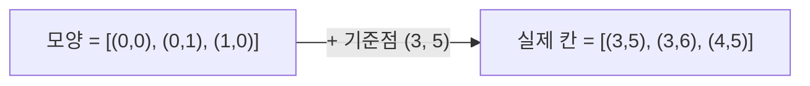

상대 좌표: 기준점에서 얼마나 떨어졌는지로 표현하고, 놓을 때 기준점만 더하기. 
패딩: 배열 바깥에 여분 칸을 둘러 경계 처리를 없애기



### 원리
- 절대 좌표 = 시작점 + 상대 좌표. 안쪽 반복은 상대 좌표(0부터)로 돌고 시작점만 더하기 ([[B20058_마법사_상어와_파이어스톰]])
```python
# 시작점 잡아줘요
for k in range(i, i + level):
    for l in range(j, j + level):  # 열 거꾸로 읽음
```
위처럼 안쪽 k, l까지 절대 좌표로 돌면, 회전할 때 다시 상대 좌표를 구하느라 시작점을 더했다 뺐다 하며 꼬임 (1시간 10분 소모)
- 패딩: 0이나 벽 값으로 한 겹 둘러싸면 `0 <= r < N` 체크 없이 이웃을 봄. 인덱스를 1부터 맞추는 효과도 ([[S13844_미로]], [[B1018_체스판_다시_칠하기]])

### 활용
- 모양이 랜덤한 덩어리를 옮길 땐 bfs로 칸을 모으고 첫 칸 기준 상대 좌표로 저장. 놓을 땐 시작점만 더함 ([[C_미생물_연구]], [[B2933_미네랄]])
- 상대 위치를 함수 안에 넣어두면 기준점만 바꿔 재사용 ([[B17779_개리맨더링2]], [[S5644_무선_충전]])
- 부분 정사각형 자르기: 큰 쪽 좌표에서 한 변 길이를 빼서 시작점, 음수면 0 ([[C_메이즈러너]])
```python
sr, sc = mxr - mn_diff, mxc - mn_diff
```
- 위에서 들어오는 블록은 위쪽에 패딩 줄을 두고 거기서 시작. 패딩 구간에 걸리면 초기화 ([[C_마법의_숲_탐색]])
- 누적합은 0 패딩으로 `i-1` 경계 처리를 없앰 ([[누적합]], [[S13786_파스칼의_삼각형]])

### 주의
- 패딩 칸 값이 원래 데이터와 섞이지 않게 구분되는 값으로. 패딩된 0을 원래 칸으로 착각하면 틀림 ([[B17779_개리맨더링2]])
- 마음대로 패딩하지 말기. 인덱스 에러를 덮으려고 3*3까지 0을 채웠다가 행/열 길이 판정이 틀어짐 ([[B17140_이차원_배열과_연산]])
- 모양을 슬라이싱으로 떼어 옮기면 0 패딩이 빠져 모양이 어그러짐. 모양은 좌표로 ([[C_미생물_연구]])
- 패딩 경계 비교는 등호 주의 (`> 3` vs `>= 3`) ([[C_마법의_숲_탐색]])
- 상대·절대가 섞이기 시작하면 인덱스 계산으로 버티지 말고 좌표 변환 함수를 하나 만들기 ([[C_미지의_공간_탈출]])

관련: [[격자_좌표_처리]], [[배열_회전과_전치]]
