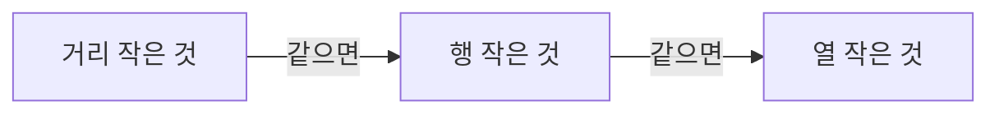

문제의 '같으면 ~ 순'을 코드로 옮기기. 대부분 정렬 key 튜플이나 탐색 방향 순서로 표현

`key=lambda x: (x[0], x[1], x[2])`. 큰 것부터인 기준은 `-x`로

### 원리
- 우선순위 목록을 그대로 튜플로. 앞 기준이 같을 때만 다음 기준을 봄 ([[정렬]], [[B21608_상어초등학교]])
- 넣는 순서가 곧 우선순위. (크기, 행, 열)로 넣으면 크기가 먼저라 행·열 순서는 소용없음 ([[B16236_아기_상어]])
- 탐색 방향을 우선순위 순서로 두기: 이동 방향 자체에 순위가 있으면(상좌우하, 우하좌상) for의 방향 순서를 그대로 ([[C_코드트리_빵]], [[C_포탑_부수기]], [[BFS]])
- 동점 처리를 따로 할 필요가 없는 경우도 있음. '나보다 큰 사람 수 + 1'이 등수면 동점자는 자동으로 같은 등수 ([[B7598_덩치]])

### 활용
- 대상 고르기: 후보를 다 모아 정렬하고 맨 앞 ([[B16236_아기_상어]], [[B21609_상어_중학교]], [[C_포탑_부수기]])
- 기준이 여러 단계면 한 lambda에: (공격력, 최근 공격 시점, 행+열, 열) ([[C_포탑_부수기]])
- 회전 각도 → 열 → 행처럼 문제마다 순서가 다름. 문제 문장을 그대로 옮겨 적기 ([[C_고대_문명_유적_탐사]])
- '가장 먼저 올라간 로봇부터'처럼 시간 순서가 우선이면, 그게 배열의 어느 쪽인지 먼저 확인 ([[B20055_컨베이어_벨트_위의_로봇]])
- 호가 층보다 우선, 같으면 낮은 층 ([[B10250_ACM]])
- max는 같은 값이면 처음 것을 고름. 뒤의 것을 원하면 뒤집거나 key를 바꾸기 ([[S4834_숫자카드]], [[B1475_방_번호]])

### 주의
- 우선순위 조건 하나를 빼먹는 실수가 잦음. 문제의 우선순위 문장을 체크리스트로 ([[C_루돌프의_반란]], [[B2933_미네랄]], [[B6087_레이저_통신]])
- '가장 가까운'이 아니라 '나보다 가까워지기만 하면'일 수도 있음 ([[C_메두사와_전사들]])
- 행 + 열 합 다음에 열인데 열 하나만 봄 ([[C_포탑_부수기]])
- 같은 문제 안에서도 단계마다 우선순위가 다를 수 있음 (첫 이동 상하좌우, 둘째 이동 좌우상하) ([[C_메두사와_전사들]])

관련: [[정렬]], [[방향_관리]]
