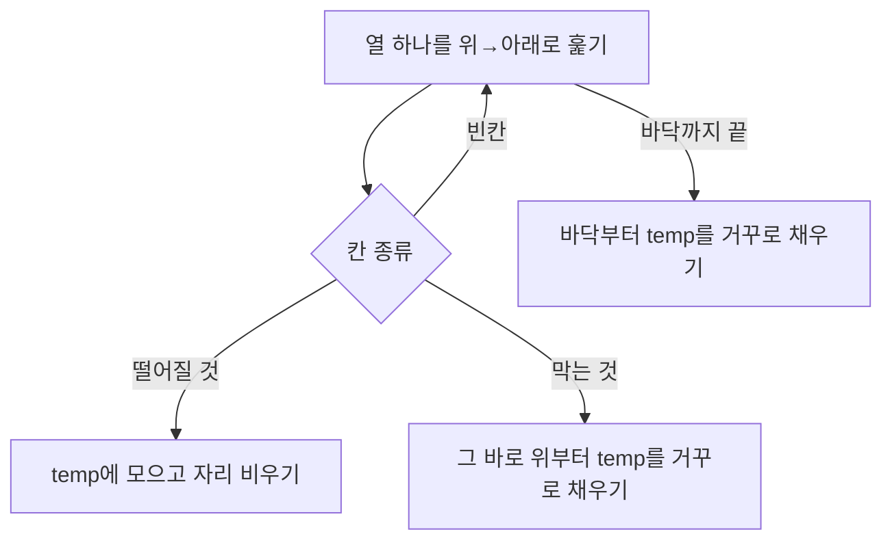

빈칸 위의 것들을 아래로 떨어뜨리기. 열마다 처리하고, 막는 것(벽, 검은 블록)이 있으면 그 위에 쌓음



### 원리
- 열마다 떨어질 것을 모아 두고, 막는 것을 만나면 그 위부터 쌓기. 끝까지 오면 바닥부터 쌓기 ([[B21609_상어_중학교]], [[B11559_Puyo_Puyo]])
```python
for row in range(size):
    if b_copy[row][col] >= 0:
        # 색 블록이면 temp로
        temp.append(b_copy[row][col])
        b_copy[row][col] = -2  # 자리 비우기
    elif b_copy[row][col] == -1:
        # 뒤에 보지 말고 바로 돌아서 역으로 채우기
        for new_row in range(row - 1, -1, -1):
```
- 방향이 열이 아니라 행이면 [[배열_회전과_전치]]로 돌려서 같은 함수를 쓰기 ([[B11559_Puyo_Puyo]], [[B20061_모노미노도미노2]])
- 덱 중간 인덱스 접근은 느려서 덱으로 중력을 짜기보다 열 단위 리스트가 나음 ([[B11559_Puyo_Puyo]])

### 활용
- 덩어리째 떨어지는 경우(모양 유지): 덩어리를 bfs로 좌표 리스트로 따고, 내 칸부터 지운 뒤 모든 칸이 내려갈 수 있는 만큼 한 칸씩 내리기 ([[B2933_미네랄]])
- 여러 덩어리가 떨어지면 아래쪽 덩어리부터 순서대로. 위부터 하면 아래가 비기 전에 멈춤 ([[C_택배_하차]])
- 블록 놓기: 위에서부터 내려오다 막히기 직전 칸에 놓기. 아래에서부터 빈칸을 찾으면 위에 뜬 블록 사이 빈 공간에 들어감 ([[B20061_모노미노도미노2]])
- 연쇄: 터뜨리기 → 중력 → 다시 터뜨리기를 터질 게 없을 때까지 반복. 동시에 터질 것은 다 모은 뒤 한 번에 ([[B11559_Puyo_Puyo]], [[B34868_Magic_Door]], [[시뮬레이션_상태_관리]])

### 주의
- 내려온 블록의 원래 자리를 지우지 않으면 두 칸에 남음 ([[B20061_모노미노도미노2]])
- 내 덩어리 칸과 남의 칸을 구별해서 멈추기. 나를 본 '이후'에 남을 만나면 멈춤 ([[C_택배_하차]])
- 모양이 랜덤인 덩어리를 '아래부터 쌓는' 방식으로 짜면 틀림. 위에서 내려 놓아야 함. 테스트 케이스로는 안 잡혔음 ([[B2933_미네랄]])
- 인접한 것만 골라서 중력을 다시 계산하려다 놓침. 전체를 다시 돌려도 시간 안이면 전부 다시 ([[C_택배_하차]])
- 체크리스트에 '중력 방향은 아래에서 볼지 위에서 볼지, 연쇄 범위는 어디까지' 넣기 ([[B18809_Gaaaaaaaaaarden]])

관련: [[배열_회전과_전치]], [[시뮬레이션_상태_관리]]
