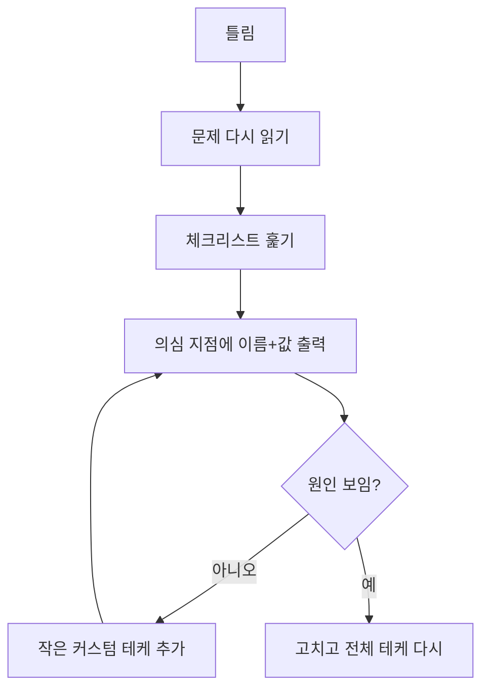

틀렸을 때 원인을 빨리 찾는 방법. 디버깅 시간이 구현 시간보다 긴 경우가 많았음



### 실수
- 원인과 상관없는 곳(덱, 분기 줄이기)만 계속 고침 ([[B17143_낚시왕]])
- '인덱스가 틀렸을 거야'라고 확신하고 시야가 좁아짐. 실제 원인은 다른 곳 ([[B5373_큐빙]])
- 큰 배열을 통째로 찍어 한눈에 안 보임 ([[B17140_이차원_배열과_연산]])
- 테케 1~3은 맞고 4만 틀리는 상태로 50분 ([[B23288_주사위_굴리기2]]). 오픈 테케가 다 맞아서 1시간 넘게 못 찾음 ([[B23290_마법사_상어와_복제]])
- 고치다 남은 코드 쪼가리가 그대로 들어감 ([[C_AI_로봇청소기]])
- 1 더하고 빼보는 식으로 고치다 같은 답만 나옴 ([[B3190_뱀]])

### 원인
- 출력 위치가 애매함. 루프 끝에서 찍은 값과 중간에서 찍은 값을 섞어 해석 ([[B19237_어른_상어]])
- 눈으로 '맞다'고 컨펌하고 실제로 찍어보지 않음 ([[C_싸움땅]])
- 마음이 급해 생각 없이 손으로 때움 ([[B17144_미세먼지_안녕]])

### 습관
- 의심 지점에서 변수 이름과 값을 같이, 한 프레임만 봐도 알게 출력. 2차원이면 arr부터 ([[B3190_뱀]], [[B23288_주사위_굴리기2]])
```python
# 적당히 arr따로, 인자 따로 뽑지 말고 print가 나를 살려주리라 생각하고 꼼꼼하고 한 프레임만 봐도 알기 쉽게 찍자
```
- 디버그 출력은 스위치 하나로 켜고 끄기. 제출 전에 print를 일일이 지우지 않아도 됨 ([[B17837_새로운_게임2]], [[C_예술성]])
```python
DEBUG = 0
def debug(*args):
    if DEBUG:
        print(*args)
```
- 어디에 찍을지 정하기. 상태 변화는 루프 맨 끝에 ([[B19237_어른_상어]])
- 보기 좋게 찍기: arr 사이에 구분 글자, 큐브는 면별 대신 전개도로 이어서 ([[B19236_청소년_상어]], [[B5373_큐빙]])
- 위치뿐 아니라 방향·시간 같은 숨은 상태도 찍기 ([[C_술래잡기]], [[C_꼬리잡기놀이]])
- 가장 의심 가는 값을 가장 먼저. 의식하고 있던 부분이라고 미루지 않기 ([[C_꼬리잡기놀이]])
- 로직을 고치기 전에 테케를 하나 더 넣어보기. 랜덤 테케 하나로 2분 만에 찾음 ([[B21608_상어초등학교]], [[B21611_마법사_상어와_블리자드]]) → [[엣지_케이스와_테스트]]
- 함수(모듈)를 하나 만들 때마다 따로 돌려보기 ([[B20057_마법사_상어와_토네이도]], [[C_나무_박멸]])
- 체크리스트를 코드 위 주석으로 적고 시작 ([[C_포탑_부수기]], [[B18809_Gaaaaaaaaaarden]], [[B6087_레이저_통신]])
  - 문제·최대최소·우선순위 되묻기 / 인덱스 손으로 돌리기 / 얕은 복사 / bfs 초기화 / continue·break / 갱신 다 했는지 / 중력 방향 / for 안 변화량 누적
- 계속 안 되면 내 해석이 틀렸을 가능성으로 생각을 바꾸기. 막히면 잠깐 나갔다 오기 ([[S1949_등산로_조성]], [[B21609_상어_중학교]])
- 하던 데서 고쳐서 꼬이면 밀고 다시 짜기 ([[B1868_파핑파핑_지뢰찾기]])

관련: [[엣지_케이스와_테스트]], [[제어_흐름]], [[시뮬레이션_상태_관리]]
