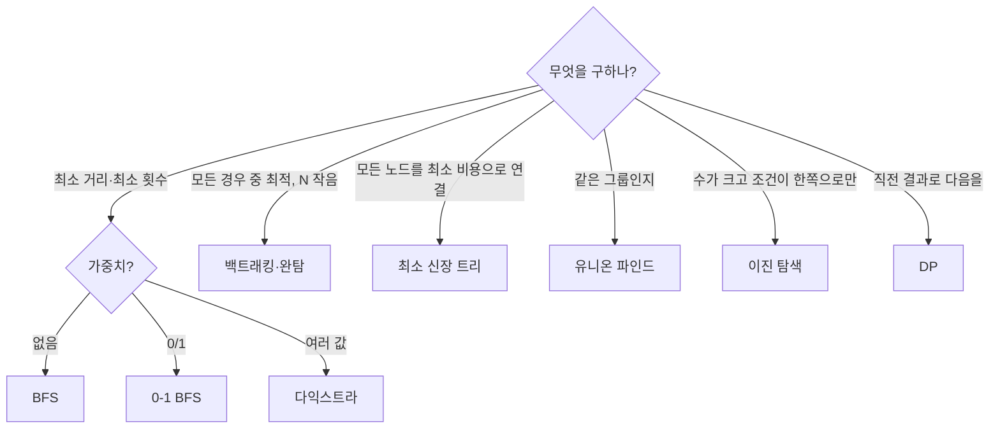

문제를 보고 어떤 알고리즘인지 고르기. 잘못 고르면 시간을 다 쓰고 처음부터 다시

### 기준
- 입력 크기가 먼저: [[시간_복잡도_추정]]의 표로 가능한 방법을 좁히기 ([[B1868_파핑파핑_지뢰찾기]], [[B8983_사냥꾼]])
- 문제의 단어가 힌트
  - '최솟값(연산 횟수, 거리)' → BFS ([[B16953_AB]], [[B16236_아기_상어]])
  - '모든 ~를 연결하는 최소 비용' → 최소 신장 트리 ([[B16389_행성_연결]])
  - '갈 수 있는가, 같은 그룹인가' → 유니온 파인드나 DFS ([[B1976_여행_가자]])
  - '누적된 비용' → 다익스트라 ([[B1261_알고스팟]])
  - '10만 이상에서 찾기' → 이진 탐색 ([[B1920_수_찾기]])
- 백트래킹 냄새: N이 작고(≤ 10), 선택 순서·조합을 모두 봐야 함 ([[B15684_사다리_조작]], [[B33927_나이트_오브_나이츠]], [[B14502_연구소]])
- 지나온 경로에 따라 맵이 바뀌면 BFS가 아님 ([[B26170_사과_빨리_먹기]], [[BFS]])

### 실수
- 최소 거리인데 BFS를 생각 못 하고 크기 정렬로 풂 ([[B16236_아기_상어]])
- 최단 경로를 백트래킹으로 → 최단 보장 X, 4¹⁰⁰ ([[C_포탑_부수기]])
- 그리디로 풀다 엣지에서 막힘 → 백트래킹 ([[B15683_감시]], [[B12764_싸지방에_간_준하]])
- BFS로 퍼뜨렸더니 경우의 수가 겹침 → 백트래킹 ([[B14500_테트로미노]])
- '모든 행성 연결'을 다익스트라로 생각 ([[B16389_행성_연결]])
- 풀어본 문제인데 기억 못 함 ([[B11727_2N_타일링]])

### 습관
- 비슷한 문제를 떠올리기: 오큰수 → 탑(왼큰수) ([[B2493_탑]]), 미생물 연구 + 택배 하차 → 미네랄 ([[B2933_미네랄]]), 온풍기 벽 처리 → 사다리 판별 ([[B15684_사다리_조작]])
- 각 알고리즘을 쓴 이유를 주석으로 남기기 ('선정 이유: 연쇄로 만날 기사를 구하는 BFS가 간단') ([[C_왕실의_기사_대결]])
- 처음 고른 방법이 막히면 버리고 다시 고르기. 하던 걸 끼워맞추지 말기 ([[C_민트_초코_우유]], [[B1868_파핑파핑_지뢰찾기]])
- 안 하던 방식을 시험 중에 처음 시도하지 않기. 대신 평소에 안 써본 방법이라고 두려워하지도 말기 ([[C_메두사와_전사들]], [[C_미생물_연구]])

관련: [[시간_복잡도_추정]], [[문제_읽기와_해석]]
