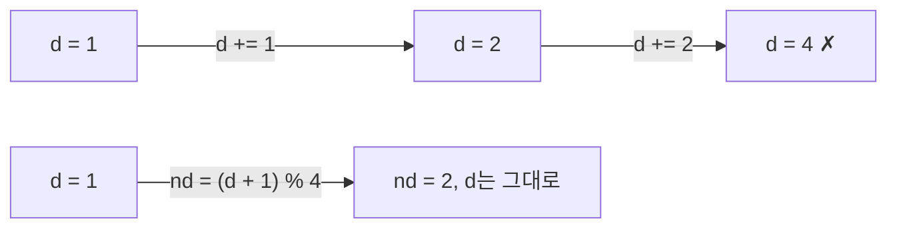

변수 이름이 헷갈리거나, 변수에 의도하지 않은 값이 섞여 들어가는 실수


원래 변수에 변화량을 누적하면 다음 반복에서 이전 변화가 섞임

### 실수
- 변수 오염
  - 방향 d에 델타를 바로 누적해 0, 1, 3, 6처럼 튐. 머릿속으로는 맞다고 컨펌 ([[C_싸움땅]])
  - 체력을 루프 안에서 누적해서 깎음 ([[B25173_용감한_아리의_동굴_대탈출]])
  - 이번 턴 속력 s를 바꿔버려 다음 계산이 틀어짐 ([[B17143_낚시왕]])
  - 이미 돌고 있는 i, j를 다시 갱신 ([[B16955_오목_이길수있을까]])
  - 바깥에서 한 번 빼둔 방향 변수를 곳곳에서 써서 바뀌어야 할 때 안 바뀜 ([[B17837_새로운_게임2]])
- 이름 실수
  - 오타: temp, sd/ss, r_ 두 글자 누락 ([[B5373_큐빙]], [[B20056_마법사_상어와_파이어볼]], [[C_술래잡기]])
  - 다른 변수를 씀: select_v 대신 arr, arr[0] 대신 arr ([[C_나무_박멸]], [[B17140_이차원_배열과_연산]])
  - 가로·세로를 반대로 이름 짓고 끝까지 그대로 ([[C_왕실의_기사_대결]])
  - c가 열인지 주사위인지 ([[B14499_주사위_굴리기]]), 이미 쓰는 n, k를 다시 씀 ([[S4837_부분집합의_합]])
  - 함수 안과 밖 이름이 같아 헷갈림 ([[B15155_오목_판정]])
- `=`로 재대입해서 기존 값이나 연결이 끊김 ([[C_술래잡기]], [[복사와_참조]])

### 원인
- 변수가 너무 많음. 달팽이 변수 8개, 몬스터 상태 6개 ([[C_술래잡기]], [[B30038_Overdose_Runner]])
- 집중력이 떨어진 후반부 ([[B15685_드래곤_커브]])

### 습관
- 이번 턴에만 쓰는 값은 새 변수로: `nd`, `ns`, `nr`, `nc` ([[C_싸움땅]], [[B17143_낚시왕]])
```python
# d를 쓰고 싶었으면 (d + 1) % 4 -> 이것도 안 됨
# 맨 처음에 d 안 보고 1부터 더하고 가니까...................
```
- 루프 안 누적 금지. 체크리스트에 '변화량 누적' 넣기 ([[B25173_용감한_아리의_동굴_대탈출]], [[B18809_Gaaaaaaaaaarden]])
- 이름 규칙 통일: 함수 인자 sx, sy / 입력 s_x, s_y처럼 ([[B7562_나이트의_이동]]). 좌표는 처음부터 r, c
- 상태가 많으면 이름을 붙여 묶기 (공격력, 사거리, 이속...) ([[B30038_Overdose_Runner]])
- 변수를 줄이는 구조로 바꾸기: 달팽이는 벡터 리스트 하나로 ([[C_술래잡기]], [[달팽이]])
- 변수 범위(global) 규칙은 [[변수_범위]]

관련: [[변수_범위]], [[시뮬레이션_상태_관리]]
