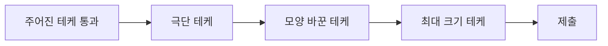

주어진 테케가 다 맞아도 틀릴 수 있음. 직접 테스트 케이스를 만들어 경계를 찔러보기

### 실수
- 테케·커스텀 테케가 다 맞았는데 1%, 93%, 94%에서 틀림 ([[B21609_상어_중학교]], [[B16988_Baaaaaaaaaduk2(Easy)]], [[B21611_마법사_상어와_블리자드]])
- 내가 만든 테케가 마침 그 경로를 안 탐
  - 1자로 갈 수 있는 맵이라 '직진 막힘' 엣지가 안 잡힘 ([[B23289_온풍기_안녕]])
  - 가로로만 움직여 좌/우 회전 수가 같음 ([[B1726_로봇]])
  - 정사각형 조각이라 잘못 돌려도 답이 같음 ([[B23291_어항_정리]])
- 체크리스트에 있던 엣지(포탑 하나만 남음)를 빼먹음 ([[C_포탑_부수기]])
- 경계에서 놓친 것들
  - 빈 스택에 오른 괄호가 먼저 ([[S4866_괄호검사]]), 시작이 곧 목표 ([[B5014_스타트링크]]), 길이 1 ([[B2579_계단_오르기]])
  - 모두 같은 값, 모두 0 ([[B21611_마법사_상어와_블리자드]], [[B2566_최댓값]], [[B17822_원판_돌리기]]), 다 잠겨서 리스트가 빔 ([[B2468_안전_영역]])
  - 행 끝에서 길이 체크 ([[S13680_어디에_단어가]]), 꽉 차서 머리와 꼬리가 맞닿음 ([[C_꼬리잡기놀이]])
  - 자기 자신 하나짜리 구간 ([[B2018_수들의_합]]), 시작 칸이 이미 조건에 해당 ([[C_택배_하차]], [[C_AI_로봇청소기]])

### 원인
- 테케를 '맞는지 확인하려고' 만들어서, 일부러 틀리게 만드는 테케가 없음
- 문제 조건이 테케로 잘 표현되지 않는 경우(물고기가 기하급수적으로 불어남)는 만들기 어려움 ([[B23290_마법사_상어와_복제]])

### 습관
- 극단 테케: 0개 / 1개 / 전부 같은 값 / 전부 0 / 불가능한 입력(-1이 나와야 하는 경우) ([[B17142_연구소_3]], [[C_AI_로봇청소기]], [[B21609_상어_중학교]])
- 모양을 바꾼 테케: 직사각형, 막힌 길, 반대 방향 이동, 겹친 상태 ([[B1726_로봇]], [[C_택배_하차]], [[B23291_어항_정리]])
- 최대 크기 테케로 시간 확인. 5 × 5로 엣지를 보고 최대로 속도를 봄 ([[C_왕실의_기사_대결]], [[B19238_스타트_택시]])
- 랜덤 테케를 하나 더 만들어 넣으면 생각보다 빨리 찾음 ([[B21608_상어초등학교]])
- 막히는 작은 케이스를 넣어보고 제출 ([[B16236_아기_상어]])
- 일부러 거른 부분(가지치기)은 제출 전에 그 조건이 틀리지 않았는지 체크 ([[B16988_Baaaaaaaaaduk2(Easy)]])
- 결과로 검증 가능한 성질을 확인: 사분면이 잘 나뉘면 모서리는 5구역이 될 수 없음 ([[B17779_개리맨더링2]])
- 값 쪽의 경계(초기값, 0으로 나누기)는 [[초기값과_경계값]]

관련: [[디버깅_습관]], [[초기값과_경계값]]
