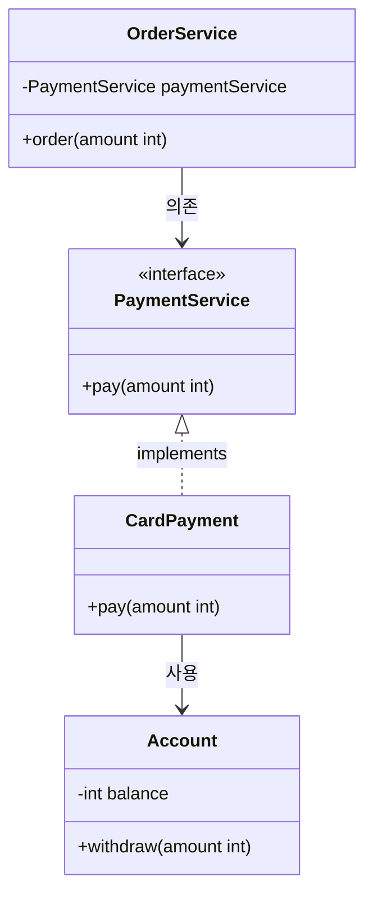
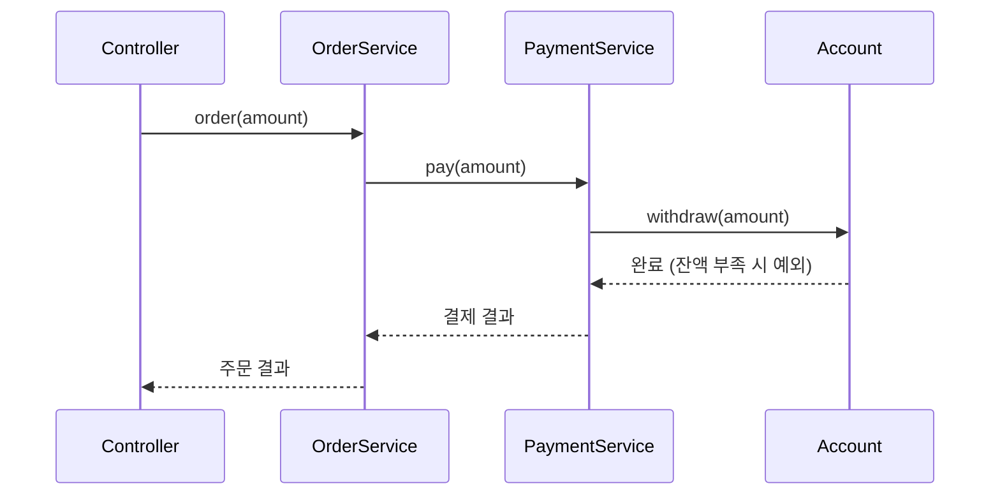

- **클래스 다이어그램 = 정적 모델(Static Model)**: 어떤 클래스가 있고, 각 클래스가 무엇을 가지며, 서로 어떤 관계인지를 보여 줘요. 건물의 **평면도**에 가까워요.
- **시퀀스 다이어그램 = 동적 모델(Dynamic Model)**: 어떤 일이 일어날 때 객체들이 **어떤 순서로 누구에게 무엇을 요청하는지**를 시간 순서대로 보여 줘요. 건물 안에서 사람이 **움직이는 동선**에 가까워요.

### 클래스 다이어그램 예시

- `-` private, `+` public
- `<|..` 인터페이스 구현, `-->` 의존(사용)
- `OrderService`가 `CardPayment`가 아니라 `PaymentService`를 바라보는 점이 포인트 [[Class_Types]]

### 시퀀스 다이어그램 예시

각 화살표가 ==뭘 주고받는지==(메소드와 파라미터, 반환)까지 적어야 getter로 값을 꺼내 쓰는 설계를 피할 수 있다. [[Getter_Setter]]

### Top-Down 설계 순서

1. **요구사항 / 유스케이스 정리**: 사용자가 무엇을 하는지
2. **큰 흐름을 시퀀스 다이어그램으로**: Controller -> Service -> ... 누가 누구에게 무엇을 요청하는지
3. **필요한 객체와 책임 도출**: 시퀀스에서 화살표를 받는 객체가 그 메소드를 가짐
4. **클래스 다이어그램으로 정리**: 필드, 메소드, 관계 (인터페이스로 의존하게) [[Object_Oriented]]
5. **세부 구현**: 각 클래스 안쪽 로직, DI 연결 [[Basics_W2]]
