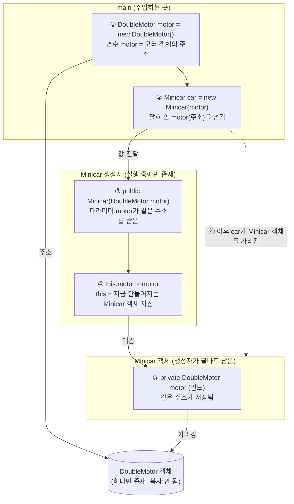

### 의존성(Dependency)이란?
의존하고 있는 대상이 변하면 의존하고 있는 주체도 영향을 받음.
ex) 클래스 안에 클래스 갖다 쓰는 거

아래 예시에는 Minicar 안에서 DoubleMotor를 가져다 쓰고 있음.
즉 Minicar는 DoubleMotor에 의존 중이다.
```java
class Minicar {
	private DoubleMotor doubleMotor;
	
	public Minicar() {
		doubleMotor = new DoubleMotor();
	} 
	public void boost() {
		doubleMotor.accelerate(20);
	}
}
```

-> 의존하고 있는 객체의 내부 메소드를 알아야 하는 경우 생김.

예를 들어 위 예시에서, doubleMotor 안의 accelerate 메소드가 사라지면 Minicar 클래스도 에러가 날 것임.

##### 강한 결합 약한 결합
강한 결합: 아예 클래스 안에서 새로운 객체를 만들기 (위 예시)
-> 그 객체가 변경될 시 클래스를 전부 수정해야 할 수 있음

약한 결합: 외부에서 객체를 주입받는 것
-> 단, `DoubleMotor` 같은 구체 클래스를 주입받으면 그 타입에는 여전히 의존함. 인터페이스 타입으로 받으면 구현체를 바꿔 끼울 수 있어 더 느슨해짐 [[Class_Types]]

### 의존성 주입(Dependency Injection)이란?
객체가 일하는데 필요한 의존 객체를 직접 만들지 않고 밖에서 받아 쓰는 것.

```java
class Minicar {
    private DoubleMotor motor;

    public Minicar(DoubleMotor motor) {   // 생성자: 밖에서 받음
        this.motor = motor;
    }
}

// 주입하는 곳 - main
DoubleMotor motor = new DoubleMotor();
Minicar car = new Minicar(motor);         // 여기서 넣어줌
```




- `Minicar car = new Minicar(motor);`: new 할 때만 실제 객체 생성, Minicar car라는 변수에는 주소 들어감.
- `new Minicar(motor)` 안의 motor 값이, 클래스 내부의 `DoubleMotor motor`로 전달됨
- `this.motor = motor;` -> 파라미터를 Minicar의 필드에 저장 (이때도 주소 가리킴)
- 어떤 모터를 쓸지는 `Minicar`를 만드는 쪽이 정함 -> `Minicar`는 `new DoubleMotor()`를 몰라도 됨

### 의존성 주입 방식
섞어 쓸 수도 있음: 필수는 생성자, 선택은 setter

#### 1. 생성자 주입
컨테이너가 생성자를 호출하면서 의존 객체를 파라미터로 넘겨줌
생성자가 1개면 @Autowired 생략 가능

```java
@Service
public class OrderService {
    private final PaymentService paymentService;

    public OrderService(PaymentService paymentService) {   // 생성자가 1개면 @Autowired 생략 가능
        this.paymentService = paymentService;
    }
}
```

- 장점
	- `final`로 고정 (setter 문 없음), 
	- 만들어지는 순간 의존성이 다 채워짐 (`null` 없음), 
	- JUnit 같은 단위 테스트가 쉬움 (Spring을 띄우지 않고 `new OrderService(가짜)`로 바로 만들어서 테스트 가능)
	- 순환 참조를 앱 구동 때 바로 발견
- 단점
	- 의존 객체가 많으면 파라미터가 길어짐 (생성 시 파라미터 여러 개 넣을테니) -> 클래스 책임이 너무 많다는 신호, ==클래스 쪼개자==
- 사용: ==기본, 필수 의존==

#### 2. setter 주입
컨테이너가 기본 생성자로 객체를 먼저 만들고, 그 뒤에 setter를 호출해서 의존성을 넣음
==@Autowired== 필요

```java
@Service
public class OrderService {
    private PaymentService paymentService;   // final 불가

    @Autowired
    public void setPaymentService(PaymentService paymentService) {
        this.paymentService = paymentService;
    }
}
```

- 장점
	- 선택적 의존성(없어도 동작)에 맞음
	- 생성 후 다시 바꿀 수 있음
- 단점
	- `final` 불가
	- 주입 전 `null` 상태가 생길 수 있음
	- setter가 열려 있는 문제 그대로 [[Getter_Setter]]
- 사용: ==기본값이 있고 (null 방지)==, 선택적 의존

##### 메소드 주입
Setter 주입이랑 유사하게, Setter 대신 일반 메소드로 의존 객체를 받는 방식

- Setter와의 차이: ==기능 차이가 아니라 관례 차이==
	- setter는 `setXxx` 이름 + 파라미터 1개가 관례 (필드 하나를 세팅하는 용도)
	- 메소드 주입은 이름이 자유롭고, 관례 상 여러 의존성을 한 번에 받는 용도로 씀
	- Spring은 둘을 똑같이 처리함

```java
@Service
public class OrderService {
    private PaymentService paymentService;

    @Autowired
    public void init(PaymentService paymentService) {   // 이름도 자유, 파라미터도 여러 개 가능
        this.paymentService = paymentService;
    }
}
```

#### 3. 필드 주입
필드에 `@Autowired`만 붙이면 Spring이 직접 값을 넣음
private이라 밖에서 접근 안 되어도 Setter, 생성자도 안 거치고 객체 안에 직접 쓸 수 있음

```java
@Service
public class OrderService {
    @Autowired
    private PaymentService paymentService;
}
```

- 장점
	- 코드가 제일 짧음
- 단점
	- 단위 테스트 때 가짜를 넣기 어려움 (생성자도 setter도 없어서 `new`로 만든 뒤 넣을 방법이 없음 -> Spring을 띄우거나 리플렉션 같은 우회 필요), 
	- `final` 불가
	- 의존성이 몇 개인지 눈에 안 띔
	- Spring 밖에서 `new`하면 의존성이 `null`
- 쓰는 때: 실무 코드에서는 비권장 (테스트 코드에서 간혹 사용)

|                | 생성자                  | setter                  | 필드             |
| -------------- | -------------------- | ----------------------- | -------------- |
| `final` 불변     | 가능                   | 불가                      | 불가             |
| `null` 방지      | 보장                   | 보장 안 됨                  | 보장 안 됨         |
| 단위 테스트 (JUnit) | 쉬움 (`new`로 가짜 바로 전달) | 가능 (`new` 후 setter로 전달) | 어려움 (넣을 통로 없음) |
| 의존성 파악         | 생성자만 보면 됨            | setter를 찾아야 함           | 필드를 다 봐야 함     |
| 권장             | 필수 의존성               | 선택 의존성                  | 비권장            |

##### 생성자 주입을 권장하는 이유

1. **불변성**: `final`로 고정, setter라는 문을 안 열어도 됨 [[Getter_Setter]]
2. **필수 의존성 보장**: 객체 만들 때 반드시 들어오므로 `null` 상태가 없음, 의존성 받는 단계에서 이상이 있으면 바로 오류가 남
3. **테스트 쉬움**: JUnit 단위 테스트에서 진짜 대신 ==가짜(mock) 객체를 생성자로 바로 넣어볼 수 있음==
   (진짜 결제 서비스를 쓰면 실제로 결제가 되거나 DB가 필요한데, 가짜를 넣으면 그런 것 없이 `OrderService` 로직만 따로 확인 가능)
4. **순환 참조를 시작 시점에 발견**: 실행 중이 아니라 앱 구동 때 에러가 남

### IoC (Inversion of Control, 제어의 역전)
객체를 만들고 연결하는 **제어권**을 개발자 코드가 아니라 **Spring 컨테이너**가 가짐
- 내가 `new` 하던 것 -> 컨테이너가 객체(Bean)를 만들고 필요한 곳에 넣어 줌
- DI는 IoC를 구현하는 방법 중 하나

##### @Configuration / @Bean
직접 만든 클래스가 아니거나, 생성 방법을 직접 지정하고 싶을 때 자바 설정 클래스로 Bean을 등록

```java
@Configuration
public class AppConfig {

    @Bean
    public PaymentService paymentService() {
        return new CardPayment();
    }

    @Bean
    public OrderService orderService() {
        return new OrderService(paymentService());   // 의존 관계를 여기서 연결
    }
}
```

- `@Configuration`: 이 클래스가 Bean 설정 정보라는 표시
- `@Bean`
	- new 대신 주입하려는걸 넣어줌
	- 메소드 반환 객체를 컨테이너에 Bean으로 등록 (이름은 기본적으로 메소드 이름)
	- Spring이 `@Bean` 메소드를 실행해서 **반환한 객체**를 보관하고, 메소드 이름(`paymentService`)을 이름표로 붙임
	- 나중에 이 이름표로 꺼내거나(`getBean("paymentService", ...)`), 필요한 곳에 주입해 줌
	- 구현체를 바꾸고 싶으면 `@Bean` 메소드 한 곳만 수정 -> [[Class_Types]]의 인터페이스 의존 효과
	- 사용하는 쪽(`OrderService`)이 구현체(`CardPayment`)가 아니라 **인터페이스**(`PaymentService`)에만 의존함
	- 어떤 구현체를 쓸지 정하는 곳이 설정 클래스 한 곳에 모여 있기 때문 -> 인터페이스 의존 + 의존성 주입 (응집성 높아짐)

##### AnnotationConfigApplicationContext
자바 설정 클래스(`@Configuration`)를 읽어서 만드는 Spring 속 컨테이너
```java
ApplicationContext ac = new AnnotationConfigApplicationContext(AppConfig.class);

OrderService orderService = ac.getBean("orderService", OrderService.class);
```

- 생성 시 `@Bean` 메소드들을 호출해서 Bean을 등록하고 의존 관계를 주입
- `getBean(이름, 타입)`으로 꺼내 쓸 수 있음
- Spring Boot에서는 이 과정을 자동으로 해 줌 (`@SpringBootApplication`, `@Service`, `@Component` 스캔) [[Basics_W1]]

### 참고
- [Dependency Injection :: Spring Framework](https://docs.spring.io/spring-framework/reference/core/beans/dependencies/factory-collaborators.html)
- [Spring Beans and Dependency Injection :: Spring Boot](https://docs.spring.io/spring-boot/reference/using/spring-beans-and-dependency-injection.html)

### 토론 주제
1. 왜 생성자 주입 방법이 기본이 되었을까?
	편해서, 한 번에 클래스 안에 있는거 다 만들어준다 - 생길때 null 없이 같이 들어온다, oop 유지

2. 왜 Setter와 Getter를 마구잡이로 쓰면 안될까?
	setter인 경우 값 바꾸거나 null 될 수 있다. getter의 경우, 공식적으로 받아야 할 값을 슬쩍 봐버려서 다른 사람이 코드를 볼 때 왜 동작하는지 모르는 코드가 될 수 있다.

3. 왜 객체 만들고 제어하는 권한을 개발자가 아니라 Spring 시스템이 가지는 걸까?
	편해서, 어느정도 형식 비슷, 실수 없게 시스템 위탁(개발자는 개발에 집중)

### 퀴즈
1. @Autowired를 생략할 수 있는 의존성 주입 방법은?
   **생성자 주입** (생성자가 1개일 때만. setter, 필드, 메소드 주입은 `@Autowired`를 꼭 붙여야 함)
   
2. 클래스 안에서 객체를 안 만들고 의존성을 주입하는 이유?
   어떤 객체를 쓸지 **밖에서 정하게 해서 결합도를 낮추기 위해**
	- 구현체를 바꿔도 클래스 코드를 안 고쳐도 됨 (인터페이스 의존 + DI)
	- 테스트 때 가짜(mock) 객체를 쉽게 넣을 수 있음

3. null 상태가 날 수 있는 의존성 주입 방법은? 
   **setter 주입** (객체 생성 후 setter가 호출되기 전까지 `null`)

- 메소드 주입도 같은 이유로 가능
- 필드 주입은 Spring 밖에서 `new`하면 `null`
- 생성자 주입은 `null` 상태가 없음


### 더 알아볼 내용 (질문)

bean 어떻게 만드는지
setter getter - 그냥 메소드 만들듯이 하면 됨, 이름만 get, set
자바 OOP