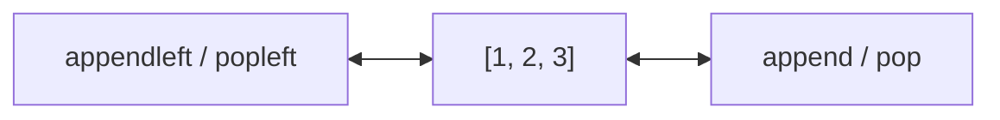
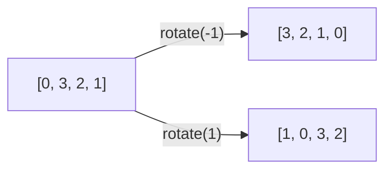

### 생성
양쪽 끝에서 넣고 뺄 수 있는 큐(double-ended queue). 앞뒤 넣기·빼기가 O(1)
- `from collections import deque`, `dq = deque()` 또는 `deque(lst)`. 리스트로 선언하면 rotate 안 됨 ([[B14503_로봇_청소기]])
- 양 끝은 빠르지만 중간 인덱스 접근은 O(N)으로 느림. 중간을 자주 봐야 하면 리스트 ([[B11559_Puyo_Puyo]])
- 쓰임: BFS의 큐 ([[BFS]]), 방향 순서 돌리기 ([[B14503_로봇_청소기]], [[B13901_로봇]]), 톱니처럼 도는 줄 ([[B14891_톱니바퀴]]), 0-1 BFS ([[B14497_주난의_난]])

```python
from collections import deque
dq = deque([1, 2, 3])
```


### 활용
- 넣기 `append` / `appendleft`, 빼기 `pop` / `popleft`, 여러 개 넣기 `extend` / `extendleft`
- `rotate(1)`: 맨 뒤가 맨 앞으로 (pop → appendleft). `rotate(-1)`: 맨 앞이 맨 뒤로 (popleft → append). 톱니처럼 원소가 시계 방향 순서로 들어 있으면 1이 시계 회전, -1이 반시계 회전. 들어 있는 순서에 따라 반대가 되니 손으로 한 번 확인 ([[B14891_톱니바퀴]], [[B14503_로봇_청소기]])
```python
dir_d = deque([0, 3, 2, 1])    # 덱으로 돌려가며...
dir_d.rotate(-1)               # 한 칸 돌리기
```

- 방향이 바뀌었으면 덱도 같이 돌리기. 좌표만 -로 뒤집으면 그 단계는 맞아도 다음 방향부터 어긋남 ([[B23288_주사위_굴리기2]], [[B3190_뱀]])
- 앞에 넣기로 우선순위 주기. 가중치 0이면 맨 앞, 1이면 맨 뒤 → bfs 한 번으로 최단 (0-1 BFS). 큐가 잔뜩 늘어나는 것도 막음. 리스트 `insert(0, x)`는 느리니 덱이면 `appendleft(x)` ([[B14497_주난의_난]], [[B1261_알고스팟]])
```python
if arr[nr][nc] == '0':
    v[nr][nc] = v[r][c]
    q.insert(0, (nr, nc)) # 가중치 0이면 q의 맨 앞에
elif arr[nr][nc] != '0': # 목적지도 포함...
    v[nr][nc] = v[r][c] + 1
    q.append((nr, nc)) # 가중치 있으면 q의 맨 뒤에 -> 한 레벨에 한 번만 동작
```
- 작은 값을 `appendleft` / `extendleft`로 앞에 넣으면 정렬이 필요 없음 ([[B16235_나무_재테크]])
- 덱을 돌려 옆끼리 묶는 것과 조합은 다른 문제 ([[B14889_스타트와_링크]])
- 순열 8!개 안에서 매번 덱을 만들고 rotate를 반복하다 시간 초과. 베이스처럼 단순한 상태는 int나 인덱스로 바꿔서 통과 ([[B17281_야구]])

### 소멸
- [[Queue]]와 같음. `while dq:`로 비면 끝, 빈 덱에 pop은 에러

관련: [[Queue]], [[Stack]], [[BFS]]
