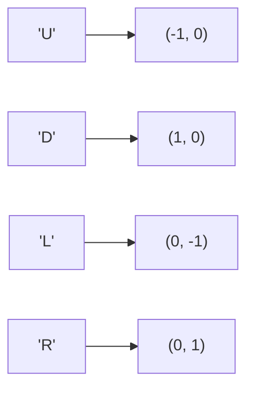

### 생성
key → value 짝. key로 바로 조회(평균 O(1)). key는 중복 불가. 넣은 순서는 유지됨
- `d = {}`, 컴프리헨션 `{k: v for ...}`, 같은 기본값으로 한꺼번에 `dict.fromkeys(seq, 기본값)` ([[B21608_상어초등학교]])
- 쓰임
  - 방향·명령 매핑 ([[B14503_로봇_청소기]], [[S1873_상호의_배틀필드]], [[B1063_킹]])
  - 룩업 테이블: 가위바위보 승패 ([[S13845_토너먼트_카드_게임]]), 괄호 짝 ([[S4866_괄호검사]]), 구조물별 갈 수 있는 방향 ([[S1953_탈주범_검거]])
  - 번호로 객체 관리: 상어, 좀비, 기사 ([[B19237_어른_상어]], [[B23031_으어어...에이쁠_주세요]], [[C_왕실의_기사_대결]])
  - 크기를 모르는 방문 기록. 값이 10⁹까지라 배열을 못 만들 때 ([[B16953_AB]])
  - 무한 격자의 좌표 ([[S5653_줄기세포배양]]), 개수 세기 ([[S4865_글자수]]), 트리 노드 (부모: (왼, 오)) ([[B1991_트리_순회]])


명령 문자를 key로 두면 분기 없이 `d[cmd]`로 바로 이동량

### 활용
- 같은 key에 다시 넣으면 덮어씀. 한 노드에서 여러 곳으로 가면 value를 리스트나 set으로 ([[S4871_그래프_경로]], [[B23289_온풍기_안녕]])
- 개수 세기는 `get`으로 if-else 없이 한 줄 ([[S4865_글자수]])
```python
t_dict[char] = t_dict.get(char, 0) + 1
```
- 자주 쓰는 메서드: `items()`(키, 값 쌍), `get(k, 기본값)`, `update()`(합치기, 겹치는 key는 덮어씀), `setdefault(k, 기본값)`(없을 때만 넣음), `popitem()`(마지막에 넣은 것 꺼냄) ([[B21608_상어초등학교]])
- key·value 뒤집기 `{v: k for k, v in d.items()}`. value가 겹치면 하나만 남음 ([[B21608_상어초등학교]])
- 검색 대신 조회: 루프마다 `rfind()`로 찾으면 O(N). 루프 밖에서 dict로 만들어 두면 조회 O(1) ([[S4864_문자열_비교]])
- 없는 key를 조회하면 에러. 빈 칸에서도 루프가 안전한지 확인 ([[B20056_마법사_상어와_파이어볼]])
- 좌표는 튜플로 key ([[S5653_줄기세포배양]], [[B23289_온풍기_안녕]])

### 소멸
- for로 도는 중에 pop하면 에러. 새 dict를 만들어 통째로 덮어씌우기 ([[S5653_줄기세포배양]])
- `del d[k]`로 지우기 ([[S4871_그래프_경로]])
- 다 쓴 값(질량 0 등)을 바로 지우지 않으면 쓰레기 값이 다음 턴에 영향 ([[B20056_마법사_상어와_파이어볼]])

관련: [[Set]], [[자료구조_선택_기준]]
