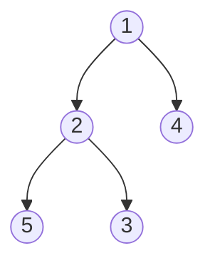

### 생성
최솟값을 빠르게 꺼내는 완전 이진 트리. 파이썬 `heapq`는 최소 힙. 넣기·빼기 O(log N)
- `hq[0]`(루트)만 가장 작은 값으로 보장. 나머지 칸의 순서는 보장 안 함
- `import heapq`, `hq = []`에 `heappush`로 넣어가며 만들기. 리스트가 이미 있으면 `heapq.heapify(lst)`로 한 번에
- `hq.append`로 넣으면 힙 순서가 깨져 일반 리스트가 됨 ([[B1261_알고스팟]])
- 먼저 다 넣어두고 꺼내기 시작해야 하는 문제도 있음 ([[B1715_카드_정렬하기]])
- 쓰임: [[다익스트라]], 프림 ([[최소_신장_트리]]), 가장 작은 둘 합치기 ([[B1715_카드_정렬하기]]), 좌석 배정 ([[B12764_싸지방에_간_준하]])


`heapify([5, 1, 4, 2, 3])` → `[1, 2, 4, 5, 3]`. 맨 위 1만 최소로 보장, 4와 3처럼 아래 순서는 뒤섞여 있음

### 활용
- 튜플을 넣으면 앞 원소부터 비교. (우선순위, 실제 값)으로 넣기 ([[B11286_절대값_힙]], [[S14252_다익스트라_최단경로]])
```python
lst.append((abs(i), i))
...
heapq.heappush(hq, lst[x])
...
ans = heapq.heappop(hq)
print(ans[1])
```
- 최대 힙은 부호를 바꿔 넣고 꺼낼 때 되돌리기 ([[B11279_최대_힙]])
- 힙 두 개로 상태 나누기: 사용 중인 좌석 (끝 시간, 번호) / 빈 좌석 번호. 끝난 좌석은 빈 좌석 힙으로 옮기고, 빈 좌석이 없을 때만 새 좌석 ([[B12764_싸지방에_간_준하]])
- `hq[0]`은 꺼내지 않고 확인만 가능 ([[B12764_싸지방에_간_준하]])
- 중간의 특정 값만 빼기는 어려움. 그대로 두고 꺼낼 때 이미 쓴 것(방문한 노드, 테이블보다 큰 값)을 거르기 ([[B11197_프림_최소_스패닝_트리]], [[S14252_다익스트라_최단경로]]). 안 되면 힙을 새로 만들기 ([[B28107_회전초밥]])
- 리스트에서 `in`으로 찾고 빼다가 20만 개에서 시간 초과 → 주문과 초밥을 힙으로 ([[B28107_회전초밥]])
- 간선이 미리 다 주어지면 힙 대신 한 번 sort로도 충분 ([[B16389_행성_연결]])

### 소멸
- `while hq:`로 빌 때까지. 빈 힙에 heappop은 에러라 `if hq:` 확인 ([[B11279_최대_힙]])
- 꺼낼 때마다 작은 순서로 나옴. 전부 꺼내면 정렬과 같고 N log N. 10⁵개 정도는 괜찮음

관련: [[다익스트라]], [[최소_신장_트리]], [[Greedy]]
