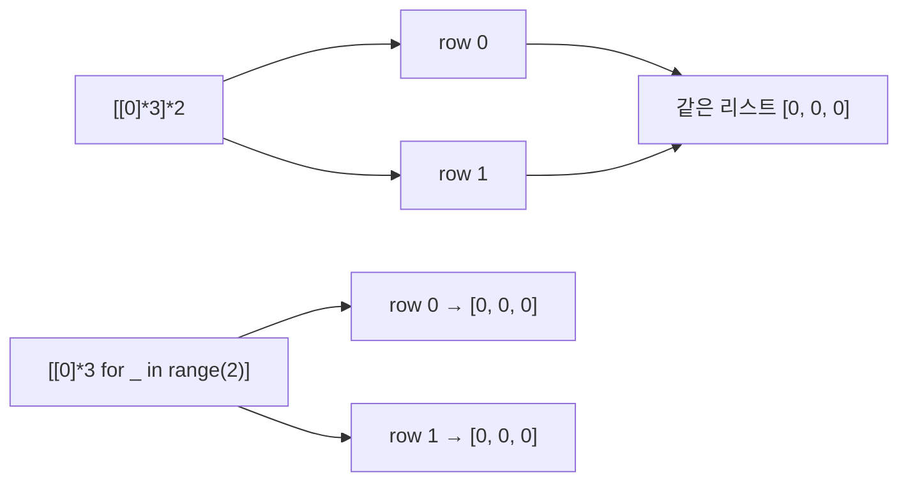

### 생성
순서가 있는 가변 배열. 인덱스로 바로 접근(O(1)), 맨 뒤 넣기·빼기 O(1)
- 1차원 `[0] * N`, 입력 한 줄 `list(map(int, input().split()))`
- 번호를 그대로 인덱스로 쓰려면 N+1개 만들고 0번은 비우기 ([[S4871_그래프_경로]])
- 2차원은 컴프리헨션으로. `[[0] * m] * n`이나 `[[]] * v`는 같은 줄 하나를 n번 가리켜서, 한 칸을 바꾸면 모든 줄이 같이 바뀜 ([[S4871_그래프_경로]])
```python
adj = [[] for _ in range (V+1)] # 인덱스 0 안 씀
```

- 2중 for로 값을 뽑아 한 리스트에 넣으면 1차원으로 평탄화됨. 줄마다 리스트를 만들어 넣기 ([[B2738_행렬_덧셈]])
- 3차원도 2차원처럼 쓰면 됨. 단 `max(map(max, arr))`는 2차원까지만. 3차원에선 리스트끼리 비교됨 ([[B7569_토마토_3차원]])

### 활용
- 값은 인덱스로 직접 바꾸기 `lst[i] = x`. `index()`는 처음 나온 위치만 줌 ([[S13655_Flatten]], [[B1475_방_번호]])
- 넣기·빼기와 앞쪽 연산 비용은 [[Stack]], [[Queue]], [[Deque]]
- 슬라이싱 `lst[a:b]`는 b 미포함인 새 리스트(복사본). 비용은 잘리는 원소 수에 비례 ([[B21609_상어_중학교]], [[S4861_회문]])
- 슬라이싱한 순간 임시 리스트라 거기에 `.reverse()`를 해도 원본은 안 바뀜. 뒤집기는 `lst[::-1]`(새 리스트), `reversed()`(이터레이터), `lst.reverse()`(제자리, 반환값 None) ([[B10811_바구니_뒤집기]])
- 2차원 `arr[i:i+8][j:j+8]`은 행을 두 번 자른 것이라 열은 안 잘림. 열까지 자르려면 `[r[j:j+8] for r in arr[i:i+8]]` ([[B1018_체스판_다시_칠하기]], [[B16935_배열_돌리기3]])
- 열 하나 가져오기는 컴프리헨션 ([[B16935_배열_돌리기3]])
```python
for i in range(len(arr[0])):
    new_arr[i] = [r[i] for r in arr]
    # 전체 행의 i번째 데이터만 가져온다 - 열만 가져오는 셈
```
- `arr[::-1][i]`는 뒤집은 새 객체에서 i번째 행 전체를 가져옴 ([[B16935_배열_돌리기3]]). 회전·전치는 [[배열_회전과_전치]]
- 슬라이싱 대입 `lst[a:b] = ...`의 오른쪽은 iterable이어야 함. 길이가 다르면 리스트 길이 자체가 바뀜 ([[S15003_원재의_메모리_복구하기]])
- 리스트 + 리스트는 새 리스트로 이어 붙이기. 쪼갠 조각을 슬라이싱해서 더하면 새 배열에 하나씩 옮길 필요 없음 ([[B23291_어항_정리]]). 복사라 안전하지만 메모리를 씀 ([[B2750_퀵_정렬_수_정렬하기]])
- 복사: `arr[:]`는 한 겹만 복사. 2차원은 `[line[:] for line in arr]` ([[B14502_연구소]], [[복사와_참조]])
- 출력: `print(*lst)`는 공백으로 구분, 문자 리스트는 `"".join(lst)` ([[S4843_특별한_정렬]])

### 소멸
- for로 도는 중에 pop하면 뒤 원소가 당겨져 다음 원소를 건너뜀. 빼지 말고 남길 것만 새 리스트에 담기 ([[B16235_나무_재테크]])
- del로 지우는 대신 필요한 것만 다른 리스트에 복사 ([[B2309_일곱_난쟁이]])
- 갱신할 땐 전체를 새로 갈아끼우기. 값이 빠진 빈 리스트가 계속 돌아다니지 않게 ([[B20056_마법사_상어와_파이어볼]])
- 추가해야 하는데 `=`로 재대입하면 기존 값이 사라짐. 추가는 extend ([[C_술래잡기]])

관련: [[Stack]], [[Queue]], [[Deque]], [[복사와_참조]]
