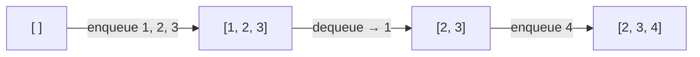

### 생성
선입선출(FIFO). 가장 먼저 넣은 데이터를 가장 먼저 꺼냄. 일렬로 늘어선 데이터를 일시적으로 쌓아두는 기본 자료구조
- 리스트로 만들기 `q = []`, 넣기(enqueue) `q.append(data)`, 빼기(dequeue) `q.pop(0)`
- 덱을 쓰면 `popleft`. 리스트 `pop(0)`은 뒤의 원소를 다 당겨서 O(N), 덱 `popleft`는 O(1) ([[Deque]])
- 큐를 전역에 두고 함수를 여러 번 부르면, 호출마다 초기화가 안 돼서 이전 값이 남거나 꼬임. 함수 안에서 만들기 ([[B14502_연구소]], [[B1868_파핑파핑_지뢰찾기]])
- 쓰임: 순서대로 처리, 길이가 유지되는 줄 ([[B3190_뱀]]), BFS ([[BFS]])

```python
q = []
q.append(data)    # enqueue
d = q.pop(0)      # dequeue

from collections import deque
q = deque()
d = q.popleft()
```


### 활용
- 넣을 때 필요한 정보를 같이 묶기. 현재 값과 거리(횟수)를 튜플로 ([[B16953_AB]])
- 객체 둘을 q 2개로 따로 움직이지 말고 하나의 상태로 엮어 넣기 ([[C_2개의_사탕]])
- `pop(0)`은 가장 앞에 있는 게 제거됨. 특정 원소를 지우려는 용도면 틀림 ([[B1092_배]])
- 리스트 `pop(0)`은 시간이 걸림. 덱 대신 썼으면 최대 케이스로 검증. 큐를 채울 땐 슬라이싱해서 붙이거나 인덱스 지정 ([[B21611_마법사_상어와_블리자드]], [[B12100_2048_easy]])
- 2048처럼 '이미 합쳐졌는지'를 따져야 하면, 넣을 때가 아니라 뺄 때 합치기를 처리해서 분기를 줄임 ([[B12100_2048_easy]])
- 길이가 유지되는 줄은 한쪽에서 append, 반대쪽에서 pop. q를 찍으면 전체 상태가 보여 디버깅이 쉬움 ([[B3190_뱀]])
```python
fr, fc = temp.popleft()    # 꼬리칸 빼기
...
temp.append((nr, nc))      # 머리칸 추가
```

### 소멸
- `while q:`. 큐가 비면 끝
- 빈 큐에 popleft는 에러. 방지문 필수 ([[B7576_토마토]])

관련: [[Stack]], [[BFS]]
