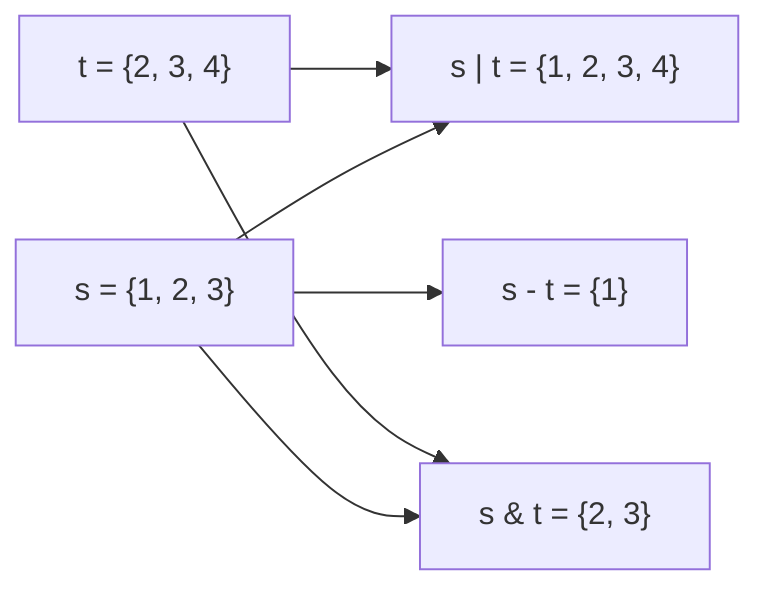

### 생성
중복 없는 집합. 순서 없음. `in` 확인이 평균 O(1)
- 빈 set은 `set()`. `{}`는 빈 dict
- `set(lst)`, 좌표는 튜플로 `{(r, c), ...}`. 리스트는 원소로 못 넣음 ([[B21610_마법사_상어와_비바라기]])
- 중복 제거 `list(set(lst))`. 순서는 깨짐 ([[B16235_나무_재테크]])
- 쓰임: 이미 있는지 확인 ([[B21610_마법사_상어와_비바라기]]), 방문한 좌표·상태 ([[B23290_마법사_상어와_복제]], [[B13460_구슬_탈출_2]]), 상태 묶음(기절·탈락·생존) ([[C_루돌프의_반란]]), 조합 판정 ([[C_민트_초코_우유]]), 중복 계산 피하기 ([[S4865_글자수]])



### 활용
- 순서가 상관없으면 `in`, `not in`은 리스트보다 set. 리스트 `in`은 O(N)이라 원소가 많으면 급격히 느려짐 ([[B21610_마법사_상어와_비바라기]])
```python
if arr[row][col] >= 2:
    if (row, col) not in cloud_lst: # 이전 구름이었던 칸은 안 됨
        arr[row][col] -= 2
        temp.add((row, col))
```
- set도 iterable이라 for로 돌 수 있음 ([[B21610_마법사_상어와_비바라기]])
- 집합 연산: `|` 합집합, `&` 교집합, `-` 차집합 ([[B15685_드래곤_커브]]). 놓을 수 있는 후보 = 전체 좌표 - 이미 놓은 좌표 ([[B15684_사다리_조작]])
- 섞이는 조합은 set으로 합치고 원소 수로 판정. 조합 함수를 따로 만들 필요 없음 ([[C_민트_초코_우유]])
- 복사는 `set(s)` ([[C_포탑_부수기]])
- 격자 크기가 정해져 있으면 2차원 배열로도 같은 확인이 가능 ([[B15684_사다리_조작]], [[B25173_용감한_아리의_동굴_대탈출]])

### 소멸
- `add`로 넣고 `remove`(없으면 에러), `discard`(없어도 괜찮음)로 빼기
- 턴마다 새 set을 만들어 통째로 갈아끼우기 ([[B21610_마법사_상어와_비바라기]])
- `idx in set(result)`처럼 확인할 때마다 set으로 바꾸면 그때마다 O(N). set은 미리 만들어 두기 ([[C_택배_하차]])

관련: [[Dictionary]], [[List]], [[자료구조_선택_기준]]
