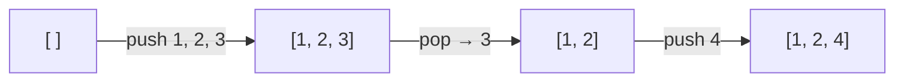

### 생성
후입선출(LIFO). 가장 나중에 넣은 데이터를 가장 먼저 꺼냄
- 만들기 `stk = []`, 넣기 `stk.append(data)`, 꺼내기 `stk.pop()`
- 조건 맞을 때 넣고 안 맞으면 빼는 식. 시간 줄이기, 저장 덜 하기
- 쓰임: 괄호 짝 ([[S4866_괄호검사]]), 반복 문자 지우기 ([[S4783_반복문자_지우기]]), 오큰수 ([[B17298_오큰수]]), DFS 되돌아올 위치 ([[DFS]])
- 선언만 스택으로 하지 않기. 요구하는 걸 정해진 자료구조로 하나하나 짜 볼 수 있어야 함



### 활용
- 넣을 때 필요한 걸 젤 위에 쌓기. 넣을 때 작업하고 꺼낼 때는 그냥 맨 위 꺼내기
- 현재 값을 넣고 다음 값과 비교하면 i-1, i+1로 index가 복잡해짐. 넣기 전에 top과 비교 ([[S4783_반복문자_지우기]])
```python
if stack:
    if stack[-1] == string[i]:
        stack.pop()
    else:
        stack.append(string[i])
else:
    stack.append(string[i])
```
- 값 대신 index를 넣기. 값은 `lst[idx]`로 꺼내 쓰면 됨 ([[B17298_오큰수]])
- 여러 개를 한꺼번에 넣을 땐 `extend`. `append`는 리스트째 들어감 ([[S1219_길찾기]])
- 사용 전 인덱스 체크. 비어 있는데 pop 하지 않게 `if stack:` ([[S13798_괄호검사]], [[B4949_균형잡힌_세상]])
- 비었는데 `stack[-1]`에 접근하면 index 에러(runtime error). index 0, 길이 0 한 번 더 생각 ([[S4866_괄호검사]])
- pop 하지 않고 쓰려면 `stack[-1]`, 다 쓰면 pop. 맨 위가 원하는 수가 아니면 어차피 하나 이상 pop 되어야 하므로 전부 훑을 필요 없음 ([[B1874_스택_수열]])
- 짝을 만났다 / 못 만났다로 생각. 스택에는 아직 짝 못 찾은 것만 남음. 짝 만날 때마다 비워지니 원래 배열을 다시 볼 필요 없음. 짝을 찾아 갱신했더라도 나도 짝을 찾아야 하면 나도 넣기 ([[B17298_오큰수]])
```python
for i in range(N):
    while stk and lst[i] > lst[stk[-1]]:   # 짝을 찾았다
        ans[stk.pop()] = lst[i]
    stk.append(i)
```
- for 2중이 터질 만큼 크면 스택으로 1중 ([[B17608_막대기]], [[B17298_오큰수]])

### 소멸
- 다 돌렸는데 스택이 남았다 = 뭔가 잘못. 처리 종료 후 stack은 비어야 함 ([[S4866_괄호검사]])
- 비었다고 성공은 아님. 하나도 안 들어와서 빈 건지 짝 맞아서 빈 건지 모름. 답을 초기화해 두고 짝이 맞아 비는 순간에 정답 처리 ([[S13798_괄호검사]])
```python
ans = 0
...
    stk.pop()
    if not stk:    # 짝 맞아서 비었을 때만
        ans = 1
```

관련: [[Queue]]
