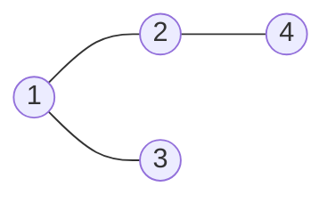

### 생성
그래프: 정점(vertex)과 간선(edge)으로 된 비선형 자료구조. 방향 / 무방향, 간선마다 가중치(비용)가 있을 수 있음. 트리는 사이클 없는 그래프
- 표현 방법: 간선 리스트, 인접 행렬, 인접 리스트, 부모 배열, 격자


- 간선 리스트: `[(1, 2), (1, 3), (2, 4)]`
- 인접 리스트: `adj[1] = [2, 3]`, `adj[2] = [1, 4]`, `adj[3] = [1]`, `adj[4] = [2]`
- 인접 행렬: `adj[1][2] = adj[2][1] = 1`, 나머지는 0

- 간선 리스트로 들어와도 그대로 쓰지 말고 인접 리스트로. 예외는 간선을 정렬해서 쓰는 크루스칼 ([[S14290_크루스칼_최소_신장_트리]])
- 인접 리스트: N+1개 만들고 0번은 비움. 양방향이면 양쪽에 append ([[S13955_너비우선탐색_템플릿]])
```python
adj = [[] for _ in range(node+1)] # 항상 +1
for _ in range(edge):
    temp = list(map(int, input().split()))
    adj[temp[0]].append(temp[1])
    adj[temp[1]].append(temp[0]) # 양 방향
```
- 단방향이면 한쪽만. 문제에 양방향 언급이 없으면 단방향 ([[S13802_길찾기]], [[B1916_최소비용_구하기]])
- 가중치가 있으면 튜플로 함께 저장 ([[S14252_다익스트라_최단경로]])
- 인접 행렬: 두 정점의 연결·가중치를 바로 확인. 대신 N² 칸이라 대부분 비어 있어 비효율. 행렬로 들어와도 인접 리스트로 바꾸기
- 부모 배열: 부모 칸에 자식을 넣는 대신 자식 칸에 부모를 넣으면, 루트까지 올라가기 쉬움 ([[B3584_가장_가까운_공통_조상]], [[B11725_트리의_부모_찾기]])
```python
adj = [0] * (nodes + 1)  # 0 안 쓴다
for _ in range(nodes - 1):
    parent, child = map(int, input().split())
    adj[child] = parent
```
- 이진 트리: 완전 이진 트리면 1차원 배열, 아니면 dict(부모: (왼, 오)) ([[트리_순회]], [[B1991_트리_순회]])
- 격자는 그 자체가 그래프. 좌표를 그래프로 바꾸지 않고 상하좌우가 이웃 ([[B1261_알고스팟]])
- 값이 10⁹까지라 정점 수를 모르면 인접 리스트를 미리 못 만듦. 탐색하면서 다음 값을 계산 ([[B16953_AB]])
- 판 위 칸 번호가 겹치면(점수 30인 칸이 두 개) 칸마다 고유 번호를 붙이고, 이름표와 인접 리스트를 따로 ([[B17825_주사위_윷놀이]])

### 활용
- 낮은 번호부터 방문해야 하면 각 인접 리스트를 정렬 ([[B1260_DFS와_BFS]], [[S13955_너비우선탐색_템플릿]])
- 이웃 돌기 `for nxt in adj[cur]`, 가중치가 있으면 `for w, nxt in adj[cur]`
- 탐색은 [[BFS]], [[DFS]], 트리는 [[트리_순회]]
- 인접 리스트가 그대로 [[Union_Find]]의 부모 테이블이 되지는 않음 ([[B1976_여행_가자]])

### 소멸
- 테스트 케이스마다 인접 리스트를 새로 만들기. 이전 케이스 간선이 남으면 결과가 섞임
- 같은 그래프를 여러 번 탐색하면 방문 정보와 거리 배열도 탐색마다 초기화. 안 하면 이전 탐색 기록이 남음 ([[B14218_그래프_탐색_2]])

관련: [[BFS]], [[DFS]], [[트리_순회]], [[Union_Find]]
