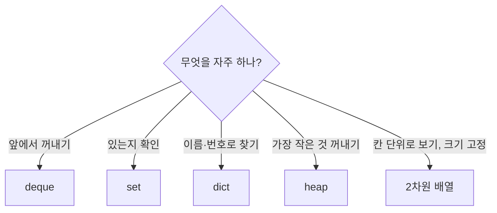

같은 문제도 자료구조에 따라 코드 길이, 속도, 디버깅 난이도가 달라짐. 구상할 때 자료구조와 함께 '언제 갱신되는지'까지 정하기 ([[B19237_어른_상어]])

| 하고 싶은 것 | 리스트 | 덱 | set | dict | 힙 |
|---|---|---|---|---|---|
| 맨 뒤 넣기·빼기 | O(1) | O(1) | - | - | - |
| 맨 앞 빼기 | O(N) | O(1) | - | - | - |
| 있는지 확인 | O(N) | O(N) | O(1) | key는 O(1) | O(N) |
| 인덱스로 접근 | O(1) | 양 끝 O(1), 중간 O(N) | 불가 | key로 O(1) | `hq[0]`만 의미 있음 |
| 최솟값 꺼내기 | O(N) | O(N) | O(N) | O(N) | O(log N) |

### 생성
- 격자 크기가 정해져 있고 작으면 2차원 배열. 끝이 없는 격자나 값이 너무 커서 배열을 못 만들면 좌표 dict·set ([[S5653_줄기세포배양]], [[B16953_AB]])
- 위치가 몇 개뿐이면 격자 대신 좌표 리스트 + set ([[B21610_마법사_상어와_비바라기]])
- N이 작으면 dict로 관리하는 것보다 배열을 완탐하는 게 단순 ([[C_메이즈러너]], [[B19236_청소년_상어]])
- 움직이는 객체(상어, 기사, 말)는 번호로 dict나 리스트에, 격자는 표시용 ([[B19237_어른_상어]], [[C_왕실의_기사_대결]], [[B17837_새로운_게임2]])
- 한 칸에 여러 개가 겹치고 그걸 칸별로 다시 연산하면 dict보다 3차원 배열이 단순 ([[B20056_마법사_상어와_파이어볼]])
- 서로 부딪히는 판정은 격자 배열이 쉬움. 상태(기절·탈락)는 set ([[C_루돌프의_반란]])

### 활용
- 리스트가 본체, 격자 arr 칸에는 같은 객체를 넣어 표시만 하면 한쪽 수정이 다른 쪽에도 보임 ([[복사와_참조]])
- 위치 dict까지 두면 매번 격자를 완탐하지 않아도 됨 ([[B17143_낚시왕]])
- 자료형이 여러 겹으로 겹치면 지금 어느 단계를 보고 있는지 놓침 ([[B20056_마법사_상어와_파이어볼]])

### 소멸
- 구현 중에 자료구조를 바꾸면 크게 갈아엎게 됨. 원판끼리도 인접한 걸 늦게 알고 dict → 2차원 배열로 교체 ([[B17822_원판_돌리기]]). 구상 때 인접 관계까지 확인
- 리스트를 set·dict·힙으로 바꿀 신호: `in` 확인이나 중간 삭제가 반복되고 개수가 수만~수십만일 때 ([[B28107_회전초밥]], [[B1931_회의실_배정]])

관련: [[List]], [[Set]], [[Dictionary]], [[Heap]], [[Deque]]
