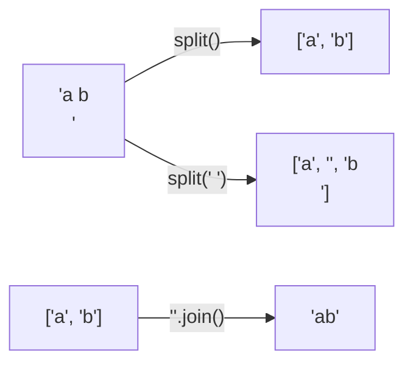

문자열(str)은 불변 시퀀스. 인덱스·슬라이싱은 리스트처럼, 칸을 고치는 건 안 됨



### 원리
- 칸을 바꾸려면 리스트로 바꿨다가 `"".join()`으로 되돌리기. 문자열 `+=`는 매번 새 문자열 ([[B1063_킹]])
- `list("abc")`는 글자 하나씩 `['a', 'b', 'c']` ([[B4949_균형잡힌_세상]])
- `split()`은 공백 여러 개·줄바꿈을 모두 구분자로 처리. `split(' ')`은 공백 하나씩 잘라 빈 문자열이 생김
- `find`, `rfind`는 없으면 -1. `index`는 없으면 에러
- `replace(바꿀 것, 새 것, 개수)` 세 번째 인자로 몇 번만 바꿀지 ([[S13717_가장_빠른_문자열]])
- 같은지 비교도 글자 수만큼 걸림. 길이 5짜리 비교면 거의 공짜 ([[B16955_오목,_이길_수_있을까]])

### 활용
- 회문: `s == s[::-1]`, 또는 앞뒤 투 포인터로 절반만 비교 ([[S4861_회문]], [[투_포인터와_슬라이딩_윈도우]])
- 한 방향 5칸을 문자열로 만들어 패턴과 비교 (X 4개 + . 1개) ([[B16955_오목,_이길_수_있을까]])
- 반복 문자 지우기는 스택 ([[S4783_반복문자_지우기]], [[Stack]])
- 글자 수 세기는 dict, 중복 없는 글자는 set ([[S4865_글자수]])
- 패턴을 찾는 루프 안에서 `rfind`를 반복하면 O(N*M). 루프 밖에서 dict로 위치표를 만들어 조회 ([[S4864_문자열_비교]])
- 그룹 단어: 이미 나온 글자인지 확인할 땐 비교를 마친 뒤에 지금 글자를 추가. 먼저 추가하면 자기 자신과 비교됨 ([[B1316_그룹_단어_체커]])
- 연속된 1의 길이: 1일 땐 세기만, 0이 나올 때 확인하고 초기화 ([[S13680_어디에_단어가]])
```python
# 답 힌트!!!!!!!: 현재 칸이 1이면 void 올리고, 0일 때 void 접근해서 goal인지 판단 후 리셋
```

### 주의
- 리스트를 `str()`로 바꾸면 괄호·쉼표까지 문자가 됨. 이어 붙이려면 `"".join(lst)` ([[S4861_회문]])
- `join`은 문자열 리스트만. 숫자 리스트는 `map(str, lst)`로 바꾼 뒤
- `input()`은 줄바꿈을 빼고 주지만 `sys.stdin.readline()`은 끝에 줄바꿈이 남아 글자 비교가 틀어짐. `rstrip()`으로 지우기 (뒤 공백도 함께 지워짐) ([[B1018_체스판_다시_칠하기]])

관련: [[자료형_변환과_비교]], [[입출력]]
