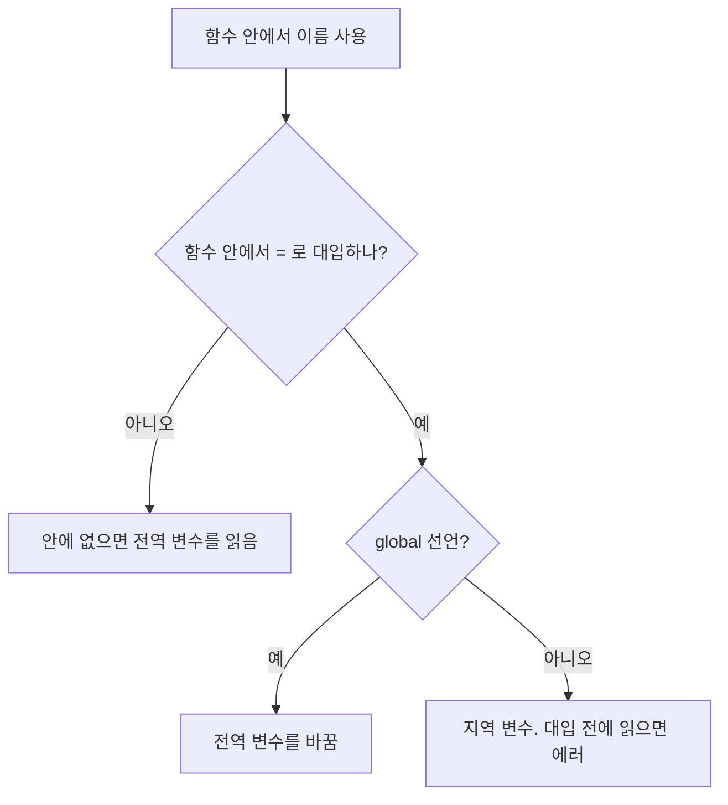

변수가 어디서 보이고 어디서 바뀌는지. 함수 안(지역)과 밖(전역)



### 원리
- 함수 안에 없는 이름은 전역에서 찾아 읽음 ([[B15155_오목_판정]])
- 함수 안에서 `=`로 대입하는 순간 그 이름은 지역 변수가 됨. 전역 값을 바꾸려면 `global` ([[S18211_N부터_1출력]])
- 리스트·arr를 append나 `arr[i] = x`로 고치는 건 대입이 아니라 안을 고치는 것이라 global이 필요 없음. 숫자 변수는 `+=`도 대입이라 global 필요 ([[S18212_1부터_N더하기]])
```python
def sum_N(i):
    # 종료 조건 가장
    global sm
    j = i + 1 # 위에 기본 변수 선언
    if j > goal:
        return
    sm += j
```
- for 변수는 루프가 끝나도 마지막 값으로 남아 있음

### 활용
- 전역에 두면 편한 것: 정답(`ans`), 한 번만 만들고 계속 쓰는 배열. bfs를 한 번만 돌리면 전역도 괜찮음 ([[S23544_신입사원]])
- 함수 안에 두어야 하는 것: 호출마다 새로 시작해야 하는 큐, 방문 배열 ([[B14502_연구소]], [[B1868_파핑파핑_지뢰찾기]])
- 상태를 계속 이어가야 하는 값은 전역으로. 주사위를 함수 안에서 만들면 돌 때마다 원래대로 돌아감 ([[B23288_주사위_굴리기2]])
- 백트래킹에서 전역 배열을 쓰면 돌아올 때 원복해야 함. 작은 배열이면 인자로 넘기는 게 덜 꼬임 ([[B15683_감시]])
- 전역 변수 대신 return 값으로 끝내는 방법도 있음 ([[B3967_매직_스타]])

### 주의
- 전역 변수가 너무 많으면 헷갈림. 달팽이 변수 8개 중 하나를 잘못 씀 ([[C_술래잡기]])
- 함수로 나누지 않으면 비슷한 변수 이름이 겹쳐 꼬임 ([[B21608_상어초등학교]])
- 변수 오염(변화량 누적)과 이름 실수는 [[변수명과_변수_오염]]

관련: [[복사와_참조]], [[재귀]], [[변수명과_변수_오염]]
