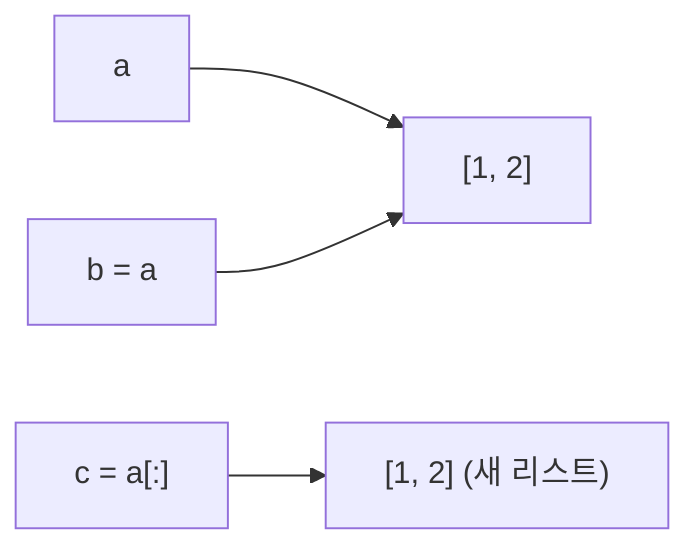

변수는 값이 아니라 객체를 가리키는 이름표. `b = a`는 복사가 아니라 같은 객체에 이름표 하나 더 붙이기 ("리스트는 주소다", [[B10819_차이를_최대로]])


`b.append(3)`이면 a도 바뀜. c는 따로

### 원리
- 가변 객체(리스트, dict, set)는 안을 고칠 수 있어서, 같은 객체를 가리키는 모든 이름에 변경이 보임
- 불변 객체(int, str, 튜플)는 안을 못 고침. `s[0] = 'a'`는 에러, 바꾸려면 새로 만들어 대입 ([[B1063_킹]])
- 불변이라 dict key, set 원소가 될 수 있음. 좌표는 튜플로. 리스트는 불가 ([[Set]], [[Dictionary]])
- 복사의 깊이
  - `arr[:]`, `list(arr)`, `arr.copy()`: 한 겹만 새로. 안쪽 리스트는 그대로 공유 ([[B14502_연구소]])
  - `[line[:] for line in arr]`: 2차원까지 새로 ([[B14502_연구소]])
  - 3차원은 `[line[:] for line in arr]`로도 안쪽이 공유됨 ([[C_메이즈러너]], [[B18809_Gaaaaaaaaaarden]])
  - `copy.deepcopy(arr)`: 끝까지 새로. 대신 느림
```python
#     v = copy.deepcopy(arr)
#     # 리스트 컴프리헨션 [line[:] for line in arr]
```
- 튜플은 `t[:]`를 해도 새로 만들지 않고 같은 객체를 돌려줌. 불변이라 공유해도 문제없음. 그래서 리스트·튜플이 섞인 `[line[:] for line in lst]`도 그대로 동작함

### 활용
- 함수 인자로 리스트를 넘기면 같은 객체가 넘어감. 함수 안에서 append·칸 수정을 하면 밖의 원본도 바뀜. 함수 안에서 `x = [...]`로 새로 대입하면 그때부터는 별개 ([[B13460_구슬_탈출_2]])
- 원본을 지켜야 하면 복사해서 넘기기. 8*8, 10*10 정도면 매번 복사해 넘겨도 괜찮았음 ([[B15683_감시]], [[B16235_나무_재테크]])
- 여러 단계가 원본을 공유하면 단계마다 복사본을 만들기: 원본 → 물고기 이동(복사) → 상어 이동(복사) ([[B19236_청소년_상어]])
- 동시에 바뀌어야 하는 값은 원본을 읽고 새 배열에 쓰기 ([[B20058_마법사_상어와_파이어스톰]])
- 일부러 공유하기: 리스트가 본체이고, 격자 arr 칸에는 같은 객체를 넣어 표시만 함. 한쪽에서 안을 고치면 다른 쪽에도 보임
```python
# 리스트가 본체, arr 마킹만, 서로 상호 참조 가능
arr[0][0] = lst[0]
arr[0][0].append(1)
```
- 읽기만 하는 데이터면 복사 없이 그대로 넣어도 됨 ([[B16985_Maaaaaaaaaze]])
- 리스트 + 리스트, 리스트 * n은 새 리스트를 만들어 안전하지만 메모리를 씀 ([[B2750_퀵_정렬_수_정렬하기]])

### 주의
- 전역 결과 리스트에 백트래킹 중인 리스트를 그대로 append하면, 나중에 pop되어 다 빈 리스트가 됨. `path[:]`로 그 순간을 복사해서 넣기 ([[B10819_차이를_최대로]])
- 공유 중인 칸에 `arr[0][0] = 0`처럼 새로 대입하면 그 칸만 다른 객체를 가리키게 되어 연결이 끊김. lst 쪽은 그대로 남음. 공유를 유지하려면 `append`·`[i] =`처럼 안을 고쳐야 함
- `[[0] * m] * n`은 같은 줄 하나를 n번 가리킴 ([[List]])
- 슬라이싱한 결과에 `.reverse()`를 해도 원본은 안 바뀜. 원본을 바꾸려면 대입 ([[B10811_바구니_뒤집기]])
- 복사하는 데도 시간이 듦. 슬라이싱 복사는 원소 수에 비례 ([[B21609_상어_중학교]])
- '방금 바꾼 데이터가 다음 칸 계산에 영향을 주는가?'를 체크리스트로 ([[B20056_마법사_상어와_파이어볼]])

관련: [[변수_범위]], [[List]], [[백트래킹]]
