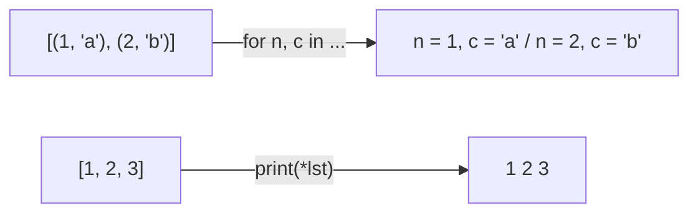

컴프리헨션: 반복문으로 리스트·dict·set을 한 줄로 만들기. 언패킹: 묶인 값을 여러 변수로 풀기



### 원리
- 리스트 `[식 for x in 반복 if 조건]`, dict `{k: v for ...}`, set `{x for ...}`
- 컴프리헨션 안의 for를 두 번 쓰면 앞의 for가 바깥 루프. 결과는 1차원으로 평탄화됨. 2차원을 원하면 컴프리헨션을 겹치기 ([[B2738_행렬_덧셈]])
- 언패킹: `a, b = map(int, input().split())`, `r, c = q.popleft()`, `for w, nxt in adj[cur]`
- `*`: 함수에 넣을 땐 풀어서 넣기 (`print(*lst)`), 받을 땐 나머지를 리스트로 (`first, *rest = lst`)
- `zip(*arr)`: 각 행을 풀어서 같은 위치끼리 묶음 → 열끼리 묶인 튜플 = 전치 ([[B17140_이차원_배열과_연산]])

### 활용
- 2차원 배열 만들기·복사 `[[0] * m for _ in range(n)]`, `[line[:] for line in arr]` ([[List]], [[복사와_참조]])
- 열 하나 뽑기 `[r[i] for r in arr]`, 부분 자르기 `[r[:c_mid] for r in arr[:r_mid]]` ([[B16935_배열_돌리기3]])
- dict 뒤집기 `{v: k for k, v in d.items()}` ([[B21608_상어초등학교]]), 역순 위치 테이블 ([[S4864_문자열_비교]])
- 전부 같은지 `all(x == lst[0] for x in lst)` ([[B16939_222_큐브]]), 모두 같은 그룹인지 `all(find(c) == goal for c in calls)` ([[B1976_여행_가자]])
```python
# all 쓰는 버릇 들이기 all(x == my_list[0] for x in my_list)
```
- 최댓값 한 줄 `max(d.get(c, 0) for c in s1)` ([[S4865_글자수]])
- 인덱스와 값 함께 `enumerate(lst)`, 시작 번호 지정 `enumerate(lst, 1)` ([[S4834_숫자카드]])
- 2차원 최댓값 `max(map(max, arr))`. 3차원에선 리스트끼리 비교되어 틀림 ([[B7569_토마토_3차원]])

### 주의
- f-string 안에서는 `*`를 못 씀 (`f'{*ans}'`는 문법 에러). `print(f"#{tc}", *ans)`처럼 바깥에서 ([[S4843_특별한_정렬]], [[S13781_깊이우선탐색]])
- `zip(*arr)` 결과는 튜플이라 칸을 못 고침. 고칠 거면 `[list(r) for r in zip(*arr)]`로 새 배열 ([[B17140_이차원_배열과_연산]])
- 너무 길게 한 줄로 쓰면 디버깅이 어려움. 행·열이 섞이기 시작하면 인덱스 반복문으로 돌아가기 ([[B20058_마법사_상어와_파이어스톰]])

관련: [[List]], [[입출력]]
