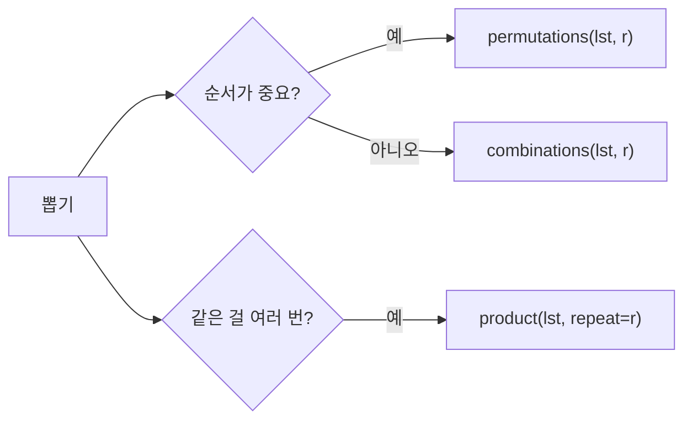

직접 구현하지 않고 가져다 쓰는 표준 라이브러리

| 모듈 | 자주 쓰는 것 | 노트 |
|---|---|---|
| `itertools` | `permutations`, `combinations`, `product` | 아래 |
| `collections` | `deque` | [[Deque]] |
| `heapq` | `heappush`, `heappop`, `heapify` | [[Heap]] |
| `copy` | `deepcopy` | [[복사와_참조]] |
| `sys` | `setrecursionlimit`, `stdin.readline` | [[재귀]], [[입출력]] |



### 원리
- `permutations(lst, r)`: 순서 있게 r개 (8개 다 쓰면 8! = 40320가지)
- `combinations(lst, r)`: 순서 없이 r개 (10개 중 5개면 252가지)
- `product(A, B)`: A와 B의 모든 짝. 같은 걸 여러 번이면 `product(lst, repeat=r)` ([[B12100_2048_easy]])
```python
#     print(rot) -> repeat을 쓰면 됨, range 2개 넣지 말고
```
- 결과는 튜플로 하나씩 나옴. 한꺼번에 리스트로 만들면 메모리를 씀

### 활용
- 바이러스 위치 중 m개 고르기 → combinations 후 bfs ([[B17142_연구소_3]], [[S25240_백두산5]])
- 벽 3개 세우기도 조합 ([[B14502_연구소]])
- 사다리 후보 좌표 전체 = 행·열 범위의 product ([[B15684_사다리_조작]])
- 타순은 permutations. 4번 타자 고정 후 나머지 8명만 ([[B17281_야구]])
- 백트래킹으로 직접 짜는 것과 같은 일. 중간에 가지치기가 필요하면 직접 짜야 함 ([[백트래킹]])

### 주의
- 개수를 먼저 계산하기. permutations 안에서 무거운 시뮬레이션을 돌리면 경우의 수 × 시뮬레이션만큼 걸림 ([[B17281_야구]])
- 조합이 몇 개 안 나오면 신경 쓸 필요 없음. 4C3, 3C3 정도 ([[B14500_테트로미노]])

관련: [[백트래킹]], [[Deque]], [[Heap]]
