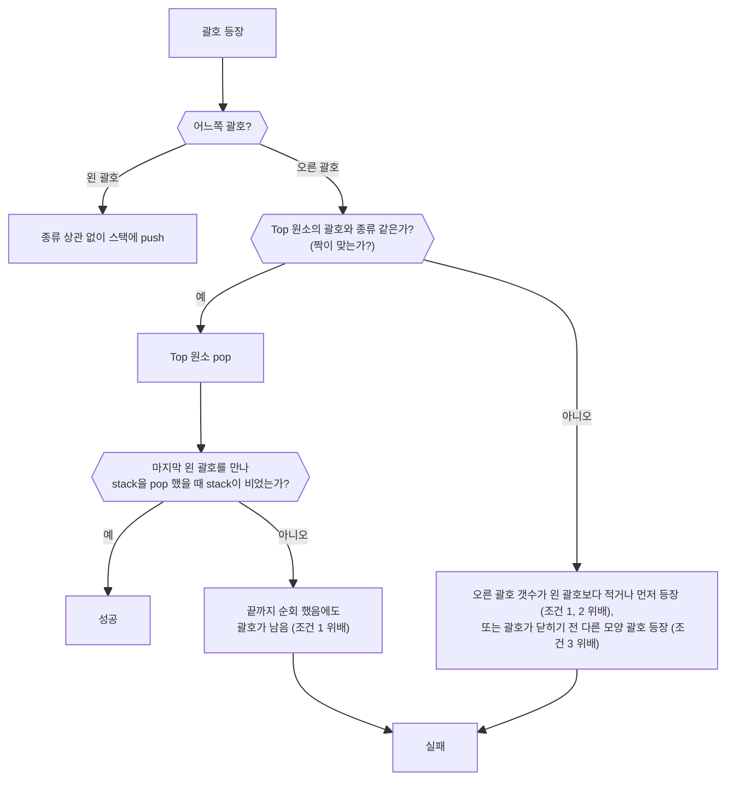

[[Python 자료구조] 스택(Stack)](https://velog.io/@yeseolee/Python-%EC%9E%90%EB%A3%8C%EA%B5%AC%EC%A1%B0-%EC%8A%A4%ED%83%9DStack)
### 개념
쌓아 올리는 자료 구조, 선형구조 (자료 간 관계가 1:1. 한 자료와 여러 자료가 연결되어있지 않다)
==후입선출== Last In First Out의 특징을 가짐
C언어: Array, Python: List로 구현

### 기본 연산 구현
파이썬에는 Stack을 위한 내장 함수나 메소드가 없다. 직접 구현해서 쓰기
함수 이름은 언어와 관계 없이 어느 정도 통일되어있으므로 그렇게 만들면 된다
java등 다른 언어에서는 있는 듯. list로 금방 구현 가능
##### - 삽입 `push()`
.append() 메소드로 금방 만들 수 있다
```python


def push(item):
	stack_list.append(item)
	


#if len(stack_list) >= 10: 
	#print("Stack Overflow!") 
	# return
	# 이런 식으로 최대 길이 제한 로직도 쓸 수 있음 
```

##### - Top 호출 후 삭제 `pop()`
이름 그대로 .pop() 메소드 사용
```python

def pop():

	if len(stack_list) == 0: #Underflow 방지
		return
	else:
		stack_list. pop (-1) #마지막 top에 접근: index = -1
```
##### - 공백 여부 확인 `isEmpty()`
```python

def isEmpty():
		if len(stack_list) == 0: 
		print ("Empty")
		return
	else:
		print ("Not empty")

```

##### - Top 원소 체크
```python

def pop():
	if len(stack_list) == 0: #Underflow 방지
		return
	else:
		return stack_list[-1] #마지막 top에 접근: index = -1
```

##### 클래스를 이용한 Stack 메소드 만들기
예시)
```python
class MyStack:
    # 1. 초기화: 스택이 처음 만들어질 때 실행되는 부분
    def __init__(self):
        self.stack_list = []  # 이 스택만의 전용 리스트를 만듭니다.

    # 2. Push: 데이터 넣기
    def push(self, item):
        self.stack_list.append(item)
        print(f"{item}이(가) 스택에 추가되었습니다.")

    # 3. Pop: 데이터 꺼내기
    def pop(self):
        if not self.is_empty():
            return self.stack_list.pop()
        else:
            return "스택이 비어있습니다!"

    # 4. IsEmpty: 비어있는지 확인 (보조 기능)
    def is_empty(self):
        return len(self.stack_list) == 0
        
# 설계도를 보고 실제 스택(객체)을 생성합니다.
s1 = MyStack()
s2 = MyStack() # 여러 개를 만들어도 각각 따로 동작합니다!

# 점(.)을 찍어서 내부의 함수를 사용합니다.
s1.push(10)  # "10이(가) 스택에 추가되었습니다."
s1.push(20)

print(s1.pop())  # 20
print(s1.pop())  # 10

```

함수가 클래스 안으로 들어가면 메소드(Method)가 되니까 덩어리로 묶어서 메소드로 호출하는 식의 구현도 좋겠다

### 응용 사례
##### 대, 중 소 괄호 검사
문제 조건
1. 왼 괄호와 오른 괄호의 총 갯수가 같아야 한다
2. 같은 괄호의 경우 왼쪽이 먼저 나와야 한다
3. 서로 다른 괄호 간 포함 관계만 존재한다: { () }는 되고 { (} )는 안 됨
   
Stack 활용 풀이 로직
괄호가 나올 때 마다 넣었다 뺐다 할 Stack을 만들어 둔다

##### 함수 호출 관리
[DFS(깊이 우선 탐색)](https://velog.io/@starrypro/DFS%EA%B9%8A%EC%9D%B4-%EC%9A%B0%EC%84%A0-%ED%83%90%EC%83%891)
함수 호출 시: 
호출 당하는 함수의 관련 변수와 데이터가 stack 맨 위에 push됨 
==호출 당한 함수가 다 돌고 원래 함수로 복귀 시==: 
관련 변수와 데이터가 pop 되어 stack이 업데이트 되고, 관련 정보는 더 이상 유효하지 않아짐

아래 예시 도식에서는 main - f1 - f2 순서로 스택이 차차 쌓였다가, 복귀할 때 pop 되며 없어짐
![[stack_function_call.jpg]]

##### 재귀함수([[Regression]]) 호출
자신의 함수 안에서 매개 변수 값만 달라지며 도는 셈
